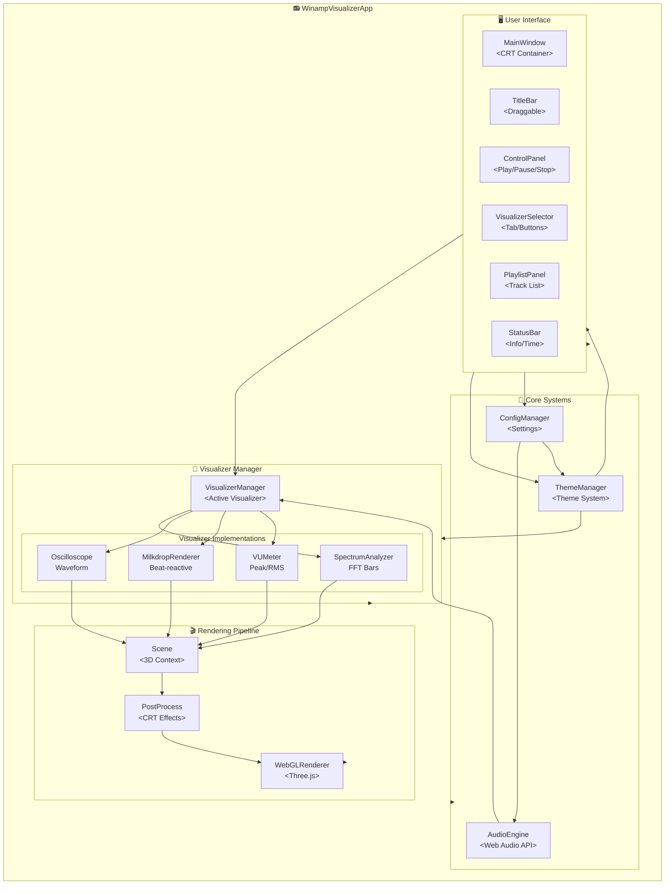
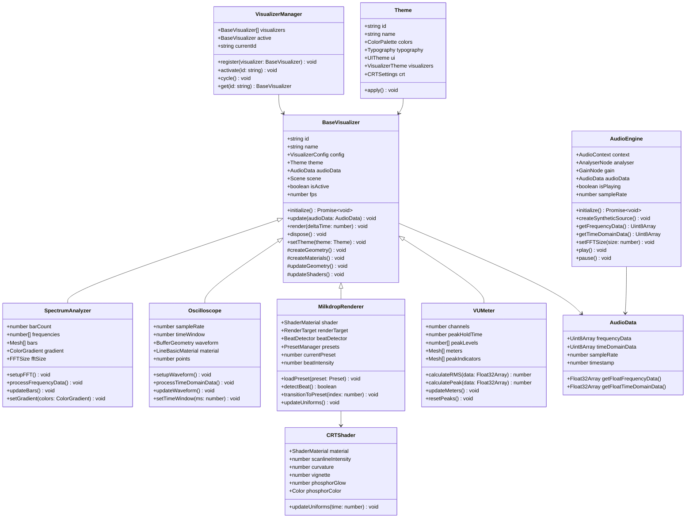
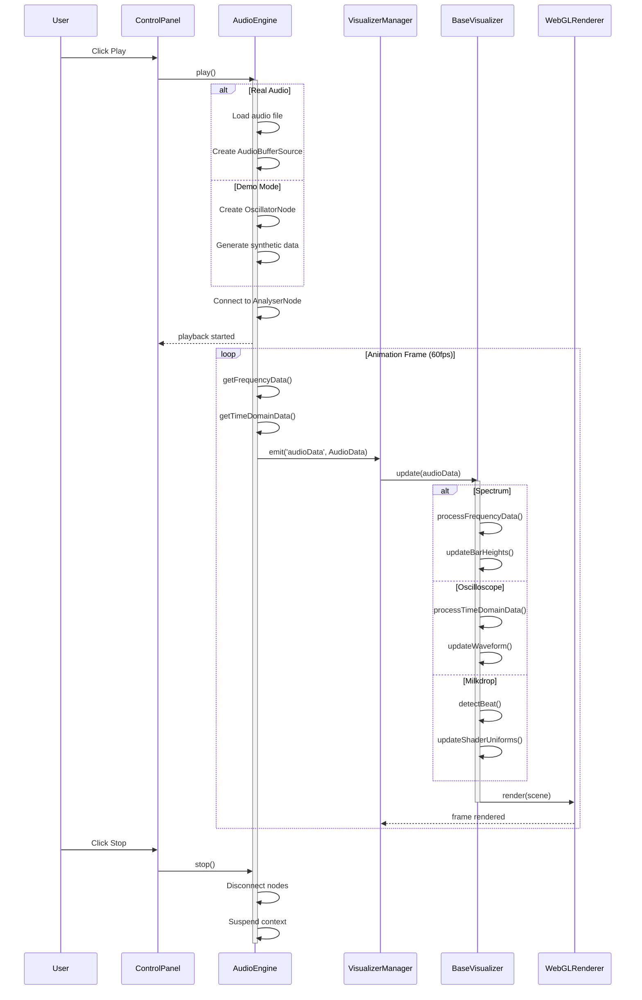
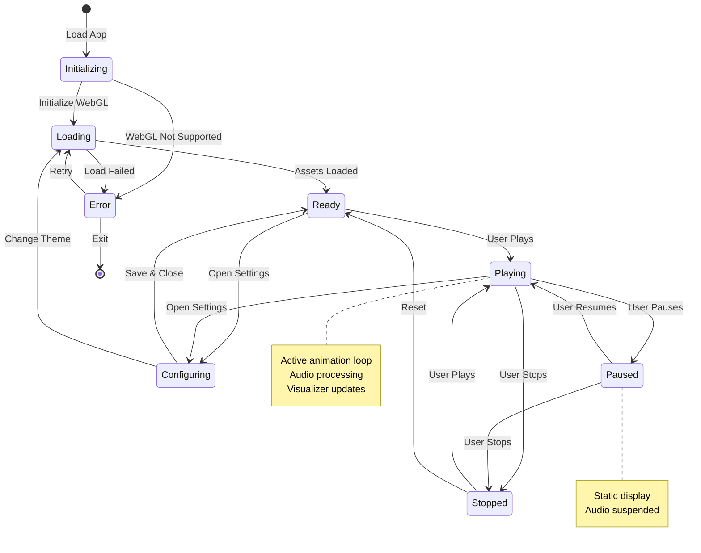
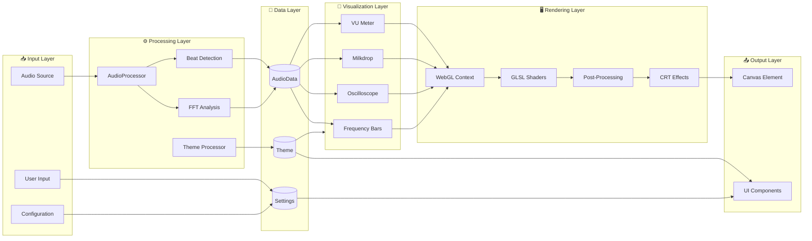
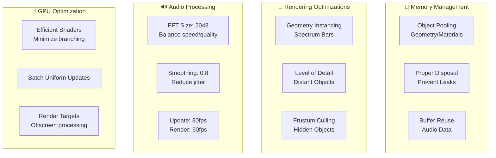
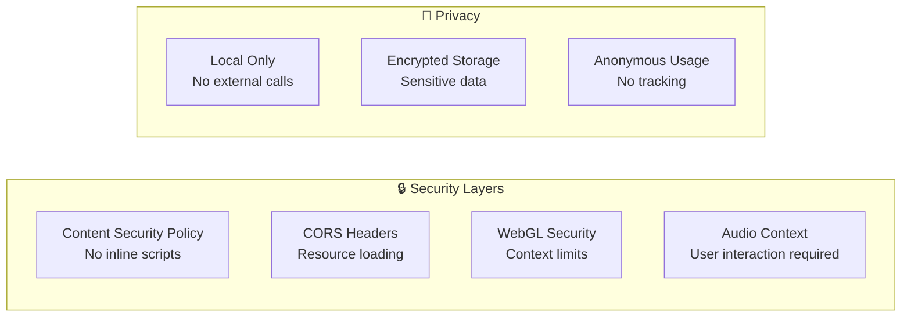

# 90s Winamp Visualizer - Architecture

```
╔══════════════════════════════════════════════════════════════════════════╗
║                    90s WINAMP VISUALIZER ARCHITECTURE                     ║
║                    « The Code Never Dies, It Just Loops »                ║
╚══════════════════════════════════════════════════════════════════════════╝
```

## System Overview

A Three.js-based music visualizer system recreating the authentic 90s Winamp/Windows Media Player experience with modern web technologies.

## Architecture Diagrams

### 1. Component Hierarchy (Flowchart)



### 2. Class Hierarchy (Class Diagram)



### 3. Audio Processing Sequence (Sequence Diagram)



### 4. Application State Machine (State Diagram)



### 5. Data Flow Architecture



## System Architecture

### Core Components

```
┌─────────────────────────────────────────────────────────────┐
│                    APPLICATION LAYER                          │
├─────────────────────────────────────────────────────────────┤
│  WinampVisualizerApp                                          │
│  ├── Event Bus (Pub/Sub)                                     │
│  ├── State Manager                                           │
│  └── Plugin System                                           │
└─────────────────────────────────────────────────────────────┘
                              │
                              ▼
┌─────────────────────────────────────────────────────────────┐
│                    VISUALIZATION LAYER                        │
├─────────────────────────────────────────────────────────────┤
│  VisualizerManager                                            │
│  ├── BaseVisualizer (Abstract)                               │
│  │   ├── SpectrumAnalyzer                                    │
│  │   ├── Oscilloscope                                        │
│  │   ├── MilkdropRenderer                                    │
│  │   └── VUMeter                                             │
│  └── PostProcessingPipeline                                  │
│      ├── CRT Shader                                          │
│      ├── Scanline Effect                                     │
│      └── Vignette + Glow                                     │
└─────────────────────────────────────────────────────────────┘
                              │
                              ▼
┌─────────────────────────────────────────────────────────────┐
│                      AUDIO LAYER                              │
├─────────────────────────────────────────────────────────────┤
│  AudioEngine                                                  │
│  ├── Web Audio API Context                                   │
│  ├── AnalyserNode (FFT)                                      │
│  ├── GainNode (Volume)                                       │
│  └── DemoGenerator (Synthetic)                               │
└─────────────────────────────────────────────────────────────┘
                              │
                              ▼
┌─────────────────────────────────────────────────────────────┐
│                      THEME LAYER                              │
├─────────────────────────────────────────────────────────────┤
│  ThemeManager                                                 │
│  ├── Theme (Base)                                            │
│  │   ├── Color Palette                                       │
│  │   ├── Typography (Bitmap Fonts)                           │
│  │   ├── UI Components                                       │
│  │   └── Visualizer Settings                                 │
│  ├── CRT Settings                                            │
│  └── Animation Curves                                        │
└─────────────────────────────────────────────────────────────┘
```

## Directory Structure

```
app-winamp-viz/
├── src/
│   ├── core/
│   │   ├── AudioEngine.ts          # Web Audio API management
│   │   ├── EventBus.ts             # Pub/sub event system
│   │   ├── ConfigManager.ts        # Settings persistence
│   │   └── StateManager.ts         # App state management
│   ├── visualizers/
│   │   ├── BaseVisualizer.ts       # Abstract base class
│   │   ├── VisualizerManager.ts    # Visualizer coordinator
│   │   ├── SpectrumAnalyzer.ts     # FFT frequency bars
│   │   ├── Oscilloscope.ts         # Waveform display
│   │   ├── MilkdropRenderer.ts     # Particle/beat effects
│   │   └── VUMeter.ts              # Volume unit meter
│   ├── audio/
│   │   ├── AudioData.ts            # Data structures
│   │   ├── AudioProcessor.ts       # Processing utilities
│   │   ├── BeatDetector.ts         # Beat detection algo
│   │   └── DemoGenerator.ts        # Synthetic audio
│   ├── rendering/
│   │   ├── Renderer.ts             # Three.js setup
│   │   ├── SceneManager.ts         # Scene organization
│   │   ├── shaders/
│   │   │   ├── crt.frag            # CRT fragment shader
│   │   │   ├── scanlines.frag      # Scanline shader
│   │   │   ├── milkdrop.frag       # Milkdrop shaders
│   │   │   └── common.vert         # Common vertex shader
│   │   └── postprocessing/
│   │       ├── CRTEffect.ts        # CRT post-processor
│   │       └── ScanlineEffect.ts   # Scanline overlay
│   ├── themes/
│   │   ├── Theme.ts                # Theme base class
│   │   ├── ThemeManager.ts         # Theme coordinator
│   │   ├── presets/
│   │   │   ├── winamp-default.ts   # Classic Winamp
│   │   │   ├── wmp-classic.ts      # Windows Media Player
│   │   │   ├── terminal-green.ts   # Matrix style
│   │   │   └── cyber-90s.ts        # Cyberpunk 90s
│   │   └── types/
│   │       ├── ColorPalette.ts
│   │       ├── Typography.ts
│   │       └── UITheme.ts
│   ├── ui/
│   │   ├── components/
│   │   │   ├── MainWindow.ts       # Main container
│   │   │   ├── TitleBar.ts         # Draggable header
│   │   │   ├── ControlPanel.ts     # Playback controls
│   │   │   ├── VisualizerSelector.ts
│   │   │   ├── PlaylistPanel.ts
│   │   │   ├── EqualizerPanel.ts
│   │   │   ├── StatusBar.ts
│   │   │   └── ContextMenu.ts
│   │   ├── styles/
│   │   │   ├── winamp.css          # 90s styling
│   │   │   └── crt.css             # CRT effects
│   │   └── utils/
│   │       ├── DragHandler.ts
│   │       └── BitmapFontLoader.ts
│   ├── types/
│   │   ├── index.ts                # Main exports
│   │   ├── audio.ts                # Audio types
│   │   ├── visualizer.ts           # Visualizer types
│   │   ├── theme.ts                # Theme types
│   │   └── config.ts               # Config types
│   ├── utils/
│   │   ├── math.ts                 # Math utilities
│   │   ├── color.ts                # Color utilities
│   │   ├── animation.ts            # Animation helpers
│   │   └── storage.ts              # Local storage
│   └── main.ts                     # Entry point
├── tests/
│   ├── setup.ts
│   ├── mocks/
│   │   ├── webgl.ts
│   │   └── webaudio.ts
│   ├── unit/
│   │   ├── visualizers/
│   │   ├── audio/
│   │   └── ui/
│   ├── integration/
│   └── e2e/
├── docs/
│   └── diagrams/
├── themes/
│   └── *.json                      # Custom theme files
├── public/
│   ├── fonts/                      # Bitmap fonts
│   ├── skins/                      # Skin images
│   └── shaders/                    # Shader files
├── index.html
├── vite.config.ts
├── vitest.config.ts
└── package.json
```

## Technology Stack

### Core Technologies
- **Three.js** - WebGL rendering engine
- **TypeScript** - Type-safe development
- **Web Audio API** - Audio processing
- **Vite** - Build tool and dev server
- **Vitest** - Testing framework

### Supporting Libraries
- **GLSL** - Custom shaders for effects
- **WebGL 2.0** - Hardware acceleration
- **localStorage/IndexedDB** - Persistence
- **ResizeObserver** - Responsive layout

## Performance Architecture



## Security Architecture



## Plugin Architecture (Future)

```
┌────────────────────────────────────────┐
│           Plugin System                 │
├────────────────────────────────────────┤
│  interface VisualizerPlugin {          │
│    id: string                          │
│    name: string                        │
│    version: string                     │
│                                        │
│    initialize(): Promise<void>        │
│    render(audioData: AudioData): void  │
│    dispose(): void                     │
│  }                                     │
└────────────────────────────────────────┘
```

## Key Design Decisions

### 1. **Audio Processing Strategy**
- **Decision**: Use Web Audio API AnalyserNode with configurable FFT size
- **Rationale**: Hardware-accelerated, consistent across browsers
- **Trade-off**: Fixed 2048 samples max, requires custom smoothing

### 2. **Rendering Strategy**
- **Decision**: Three.js with custom shaders for post-processing
- **Rationale**: Abstraction over raw WebGL, excellent documentation
- **Trade-off**: Bundle size (~150KB), but worth it for maintainability

### 3. **Theme System**
- **Decision**: JSON-based themes with runtime application
- **Rationale**: Easy to create/share, hot-reload capable
- **Trade-off**: Runtime parsing overhead, but negligible

### 4. **Demo Mode**
- **Decision**: Synthetic oscillator + noise generator
- **Rationale**: No CORS issues, works offline, consistent demo
- **Trade-off**: Not "real" audio, but sufficient for visualization

## Performance Budgets

| Metric | Target | Maximum |
|--------|--------|---------|
| Bundle Size | < 500KB | 800KB |
| First Paint | < 1s | 2s |
| Time to Interactive | < 2s | 3s |
| Frame Rate | 60fps | 30fps (minimum) |
| Memory Usage | < 100MB | 200MB |
| CPU Usage | < 30% | 50% |

## Browser Compatibility

```
Chrome  90+  ████████████████████  Full Support
Firefox 88+  ████████████████████  Full Support
Safari  14+  █████████████████░░░  WebGL2 limited
Edge    90+  ████████████████████  Full Support
```

## Next Steps

1. **Phase 1**: Core audio engine + Spectrum visualizer
2. **Phase 2**: Theme system + UI components
3. **Phase 3**: Additional visualizers (Oscilloscope, Milkdrop)
4. **Phase 4**: CRT effects + polish
5. **Phase 5**: Plugin system + extensibility

---

```
╔══════════════════════════════════════════════════════════════════╗
║  "Good architecture is like good music - the structure         ║
║   supports the art without getting in the way."                  ║
║                                          - Winamp Dev Team     ║
╚══════════════════════════════════════════════════════════════════╝
```
