# Code Quality Standards

```
╔══════════════════════════════════════════════════════════════════════════╗
║                           CODE QUALITY STANDARDS                          ║
║                    « Code is Poetry, Let's Make It Rhyme »                ║
╚══════════════════════════════════════════════════════════════════════════╝
```

## 🎯 Quality Metrics

```mermaid
flowchart TB
    subgraph Quality["📊 Quality Dimensions"]
        Readability["Readability\n- Clear naming\n- Consistent style\n- Documentation"]
        
        Maintainability["Maintainability\n- Modularity\n- Test coverage\n- Low complexity"]
        
        Performance["Performance\n- Efficient algorithms\n- Resource management\n- Optimization"]
        
        Reliability["Reliability\n- Error handling\n- Type safety\n- Edge cases"]
    end
    
    subgraph Tools["🔧 Quality Tools"]
        TypeScript["TypeScript\nStrict Mode"]
        ESLint["ESLint\nCustom Rules"]
        Prettier["Prettier\nFormatting"]
        Vitest["Vitest\nTesting"]
    end
    
    Quality --> Tools
```



## 📋 TypeScript Best Practices

### Strict Mode Configuration

```typescript
// tsconfig.json
{
  "compilerOptions": {
    "target": "ES2020",
    "module": "ESNext",
    "moduleResolution": "bundler",
    "lib": ["ES2020", "DOM", "DOM.Iterable"],
    
    // Strict type checking
    "strict": true,
    "noImplicitAny": true,
    "strictNullChecks": true,
    "strictFunctionTypes": true,
    "strictBindCallApply": true,
    "strictPropertyInitialization": true,
    "noImplicitThis": true,
    "alwaysStrict": true,
    
    // Additional checks
    "noUnusedLocals": true,
    "noUnusedParameters": true,
    "noImplicitReturns": true,
    "noFallthroughCasesInSwitch": true,
    "noUncheckedIndexedAccess": true,
    
    // Module resolution
    "esModuleInterop": true,
    "skipLibCheck": true,
    "forceConsistentCasingInFileNames": true,
    "resolveJsonModule": true,
    
    // Output
    "declaration": true,
    "declarationMap": true,
    "sourceMap": true,
    "outDir": "./dist",
    "rootDir": "./src",
    
    // Path mapping
    "baseUrl": ".",
    "paths": {
      "@/*": ["src/*"],
      "@core/*": ["src/core/*"],
      "@visualizers/*": ["src/visualizers/*"],
      "@themes/*": ["src/themes/*"]
    }
  },
  "include": ["src/**/*"],
  "exclude": ["node_modules", "dist", "tests"]
}
```

### Type Definitions

```typescript
// src/types/index.ts

// Use explicit types, avoid 'any'
export type VisualizerID = 'spectrum' | 'oscilloscope' | 'milkdrop' | 'vumeter';

// Use branded types for type safety
export type AudioSampleRate = number & { __brand: 'AudioSampleRate' };
export const createSampleRate = (rate: number): AudioSampleRate => {
  if (![44100, 48000, 88200, 96000].includes(rate)) {
    throw new Error(`Invalid sample rate: ${rate}`);
  }
  return rate as AudioSampleRate;
};

// Discriminated unions for state machines
export type AudioState =
  | { status: 'idle' }
  | { status: 'loading'; progress: number }
  | { status: 'playing'; startTime: number }
  | { status: 'paused'; pausedAt: number }
  | { status: 'error'; error: Error };

// Readonly for immutable data
export interface AudioData {
  readonly frequencyData: Uint8Array;
  readonly timeDomainData: Uint8Array;
  readonly sampleRate: AudioSampleRate;
  readonly timestamp: number;
}

// Utility types
export type DeepReadonly<T> = {
  readonly [K in keyof T]: T[K] extends object ? DeepReadonly<T[K]> : T[K];
};

export type Optional<T, K extends keyof T> = Omit<T, K> & Partial<Pick<T, K>>;
```

### Function Signatures

```typescript
// Good: Clear parameters and return type
async function loadAudioFile(
  file: File,
  options: LoadOptions = {}
): Promise<Result<AudioBuffer, LoadError>> {
  // Implementation
}

// Good: Options object for optional parameters
interface LoadOptions {
  readonly timeout?: number;
  readonly onProgress?: (progress: number) => void;
}

// Bad: Too many positional parameters
function badLoad(file: File, timeout: number, onProgress?: Function, autoPlay?: boolean) {
  // Don't do this
}

// Good: Use overloads for different call signatures
class EventBus {
  on<T extends EventType>(
    event: T,
    handler: EventHandler<T>
  ): () => void;
  
  on(
    event: string,
    handler: (data: unknown) => void
  ): () => void;
}
```

## 🎨 Code Style Guidelines

### Naming Conventions

```typescript
// Files: kebab-case.ts
// spectrum-analyzer.ts, audio-engine.ts, theme-manager.ts

// Classes: PascalCase
class SpectrumAnalyzer extends BaseVisualizer {}
class AudioEngine implements AudioProvider {}

// Interfaces: PascalCase with 'I' prefix (optional but consistent)
interface IVisualizer {}
// or
interface Visualizer {}

// Types: PascalCase
type AudioData = { ... };
type ThemeID = string;

// Enums: PascalCase for name, UPPER_SNAKE for values
enum PlaybackState {
  IDLE = 'idle',
  PLAYING = 'playing',
  PAUSED = 'paused',
  STOPPED = 'stopped',
}

// Constants: UPPER_SNAKE_CASE
const DEFAULT_FFT_SIZE = 2048;
const MAX_VOLUME = 1.0;

// Variables: camelCase
const visualizerManager = new VisualizerManager();
let currentTheme: Theme;

// Functions: camelCase, verb-first
function initializeEngine(): void {}
function calculateFrequencyBands(data: Uint8Array): FrequencyBands {}
async function loadTheme(id: string): Promise<Theme> {}

// Private members: _prefix or #private
class Example {
  private _internalState: State;
  #trulyPrivate: number; // Hard private
}

// Boolean variables: is/has/should/can prefix
const isPlaying = false;
const hasAudioData = true;
const shouldUpdate = true;
const canRender = true;
```

### Code Organization

```typescript
// src/visualizers/SpectrumAnalyzer.ts

// 1. Imports (grouped: external, internal, types)
import * as THREE from 'three';
import { BaseVisualizer } from './BaseVisualizer';
import { AudioData } from '../audio/AudioData';
import type { SpectrumConfig } from '../types';

// 2. Constants
const DEFAULT_BAR_COUNT = 64;
const MIN_BAR_COUNT = 16;
const MAX_BAR_COUNT = 256;

// 3. Types
interface BarGeometry {
  mesh: THREE.Mesh;
  targetHeight: number;
  currentHeight: number;
}

// 4. Class definition
export class SpectrumAnalyzer extends BaseVisualizer {
  // 4a. Public static properties
  public static readonly DEFAULT_CONFIG: SpectrumConfig = {
    barCount: DEFAULT_BAR_COUNT,
    fftSize: 2048,
    smoothing: 0.8,
  };

  // 4b. Private static properties
  private static _instanceCount = 0;

  // 4c. Public properties
  public readonly barCount: number;

  // 4d. Private properties
  private _bars: BarGeometry[] = [];
  private _gradient: THREE.Color[] = [];

  // 4e. Constructor
  constructor(config: Partial<SpectrumConfig> = {}) {
    super();
    this.barCount = Math.min(
      MAX_BAR_COUNT,
      Math.max(MIN_BAR_COUNT, config.barCount ?? DEFAULT_BAR_COUNT)
    );
    SpectrumAnalyzer._instanceCount++;
  }

  // 4f. Public methods (lifecycle)
  public async initialize(): Promise<void> {
    await this._createBars();
    await this._setupGradient();
  }

  public update(audioData: AudioData): void {
    this._processFrequencyData(audioData.frequencyData);
    this._updateBarHeights();
  }

  public render(deltaTime: number): void {
    this._interpolateBars(deltaTime);
    this._renderToScreen();
  }

  public dispose(): void {
    this._bars.forEach(bar => {
      bar.mesh.geometry.dispose();
      (bar.mesh.material as THREE.Material).dispose();
    });
    SpectrumAnalyzer._instanceCount--;
  }

  // 4g. Private methods
  private async _createBars(): Promise<void> {
    // Implementation
  }

  private _processFrequencyData(data: Uint8Array): void {
    // Implementation
  }

  // 4h. Getters/setters
  public get isActive(): boolean {
    return this._bars.length > 0;
  }
}
```

## 🧪 Testing Standards

### Test Structure

```typescript
// tests/unit/visualizers/spectrum.test.ts

import { describe, it, expect, beforeEach, vi } from 'vitest';
import { SpectrumAnalyzer } from '../../../src/visualizers/SpectrumAnalyzer';
import { createMockAudioData } from '../../utils/test-helpers';

describe('SpectrumAnalyzer', () => {
  // Group related tests
  describe('initialization', () => {
    it('should create with default configuration', () => {
      const analyzer = new SpectrumAnalyzer();
      
      expect(analyzer.barCount).toBe(64);
      expect(analyzer.id).toBe('spectrum');
    });

    it('should clamp bar count to valid range', () => {
      const low = new SpectrumAnalyzer({ barCount: 8 });
      const high = new SpectrumAnalyzer({ barCount: 500 });
      
      expect(low.barCount).toBe(16);
      expect(high.barCount).toBe(256);
    });
  });

  describe('audio processing', () => {
    let analyzer: SpectrumAnalyzer;
    
    beforeEach(() => {
      analyzer = new SpectrumAnalyzer({ barCount: 32 });
    });

    it('should update bar heights from frequency data', () => {
      const audioData = createMockAudioData({
        frequencyData: new Uint8Array(1024).fill(200),
      });
      
      analyzer.update(audioData);
      
      expect(analyzer.getAverageHeight()).toBeGreaterThan(0);
    });

    it('should apply smoothing between frames', () => {
      const data1 = createMockAudioData({
        frequencyData: new Uint8Array(1024).fill(255),
      });
      const data2 = createMockAudioData({
        frequencyData: new Uint8Array(1024).fill(0),
      });
      
      analyzer.update(data1);
      const height1 = analyzer.getBarHeight(0);
      
      analyzer.update(data2);
      const height2 = analyzer.getBarHeight(0);
      
      // Should smooth, not jump
      expect(height2).toBeGreaterThan(0);
      expect(height2).toBeLessThan(height1);
    });
  });

  describe('resource management', () => {
    it('should dispose all resources', () => {
      const analyzer = new SpectrumAnalyzer();
      const disposeSpy = vi.spyOn(analyzer, 'dispose');
      
      analyzer.dispose();
      
      expect(disposeSpy).toHaveBeenCalledOnce();
    });
  });
});
```

### Testing Best Practices

```typescript
// 1. Use descriptive test names
describe('when audio is playing', () => {
  it('should update visualizer at 60fps', () => {
    // Test implementation
  });
});

// 2. Arrange-Act-Assert pattern
describe('AudioEngine', () => {
  it('should pause playback', async () => {
    // Arrange
    const engine = new AudioEngine();
    await engine.load('test.mp3');
    await engine.play();
    
    // Act
    await engine.pause();
    
    // Assert
    expect(engine.isPlaying).toBe(false);
    expect(engine.currentTime).toBeGreaterThan(0);
  });
});

// 3. Test edge cases
describe('SpectrumAnalyzer edge cases', () => {
  it('should handle empty frequency data', () => {
    const analyzer = new SpectrumAnalyzer();
    const emptyData = createMockAudioData({
      frequencyData: new Uint8Array(0),
    });
    
    expect(() => analyzer.update(emptyData)).not.toThrow();
  });

  it('should handle all-zero frequency data', () => {
    const analyzer = new SpectrumAnalyzer();
    const silentData = createMockAudioData({
      frequencyData: new Uint8Array(1024).fill(0),
    });
    
    analyzer.update(silentData);
    
    expect(analyzer.getAverageHeight()).toBe(0);
  });
});

// 4. Use mocks appropriately
import { vi } from 'vitest';

describe('ThemeManager', () => {
  it('should load theme from storage', async () => {
    // Mock storage
    const mockStorage = {
      get: vi.fn().mockResolvedValue({ id: 'default', name: 'Default' }),
    };
    
    const manager = new ThemeManager(mockStorage);
    const theme = await manager.loadSavedTheme();
    
    expect(mockStorage.get).toHaveBeenCalledWith('currentTheme');
    expect(theme.id).toBe('default');
  });
});
```

## 🔧 Linting Configuration

### ESLint Config

```typescript
// eslint.config.js
import js from '@eslint/js';
import ts from 'typescript-eslint';
import prettier from 'eslint-config-prettier';

export default ts.config(
  js.configs.recommended,
  ...ts.configs.recommendedTypeChecked,
  {
    languageOptions: {
      parserOptions: {
        project: './tsconfig.json',
      },
    },
    rules: {
      // TypeScript strictness
      '@typescript-eslint/no-explicit-any': 'error',
      '@typescript-eslint/no-unsafe-assignment': 'error',
      '@typescript-eslint/no-unsafe-member-access': 'error',
      '@typescript-eslint/no-unsafe-call': 'error',
      '@typescript-eslint/no-unsafe-return': 'error',
      '@typescript-eslint/no-unused-vars': ['error', { argsIgnorePattern: '^_' }],
      '@typescript-eslint/explicit-function-return-type': 'error',
      '@typescript-eslint/prefer-readonly': 'error',
      
      // Code quality
      'no-console': ['warn', { allow: ['warn', 'error'] }],
      'no-debugger': 'error',
      'prefer-const': 'error',
      'no-var': 'error',
      
      // Import organization
      'sort-imports': ['error', {
        ignoreCase: false,
        ignoreDeclarationSort: true,
        ignoreMemberSort: false,
      }],
    },
  },
  {
    files: ['tests/**/*.ts'],
    rules: {
      '@typescript-eslint/no-explicit-any': 'off', // Allow in tests
      'no-console': 'off',
    },
  },
  prettier
);
```

### Prettier Config

```javascript
// .prettierrc.js
module.exports = {
  semi: true,
  trailingComma: 'es5',
  singleQuote: true,
  printWidth: 100,
  tabWidth: 2,
  useTabs: false,
  bracketSpacing: true,
  arrowParens: 'avoid',
  endOfLine: 'lf',
  
  // Overrides for specific file types
  overrides: [
    {
      files: '*.json',
      options: {
        printWidth: 80,
      },
    },
    {
      files: '*.md',
      options: {
        proseWrap: 'always',
        printWidth: 80,
      },
    },
  ],
};
```

## ✅ Code Review Checklist

### Before Submitting

```
□ TypeScript compiles without errors (strict mode)
□ All tests pass (npm test)
□ No linting errors (npm run lint)
□ Code formatted with Prettier (npm run format)
□ New code has unit tests
□ Edge cases handled
□ No console.log statements (except warnings/errors)
□ Documentation updated (if needed)
□ Commit messages follow convention
□ No sensitive data in code
```

### Review Criteria

| Criteria | Weight | Check |
|----------|--------|-------|
| **Correctness** | 30% | Logic is sound, edge cases handled |
| **Readability** | 25% | Clear naming, comments where needed |
| **Maintainability** | 20% | Modular, testable, documented |
| **Performance** | 15% | Efficient algorithms, no leaks |
| **Style** | 10% | Follows conventions, consistent |

### Commit Message Convention

```
<type>(<scope>): <subject>

<body>

<footer>

Types:
- feat: New feature
- fix: Bug fix
- docs: Documentation
- style: Formatting (no code change)
- refactor: Code restructuring
- test: Tests
- chore: Build/config changes

Examples:
feat(visualizer): add plasma effect renderer
fix(audio): prevent memory leak in AudioEngine
docs(readme): update installation instructions
```

---

```
╔══════════════════════════════════════════════════════════════════╗
║                                                                  ║
║  "Any fool can write code that a computer can understand.        ║
║   Good programmers write code that humans can understand."         ║
║                                           - Martin Fowler        ║
╚══════════════════════════════════════════════════════════════════╝
```
