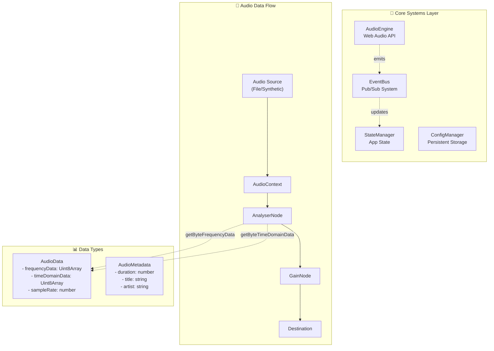
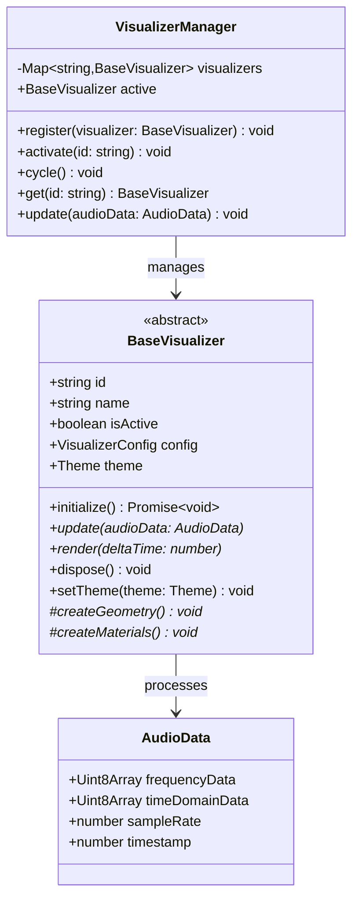
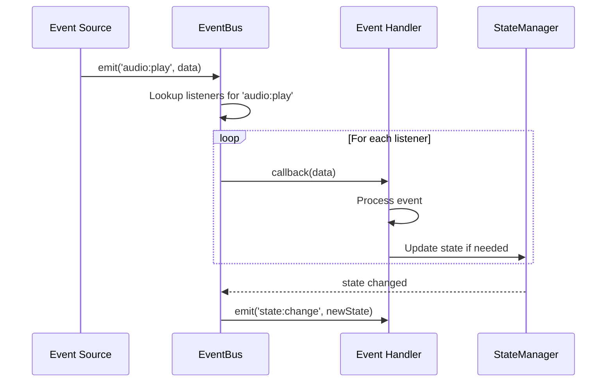
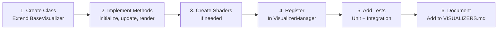
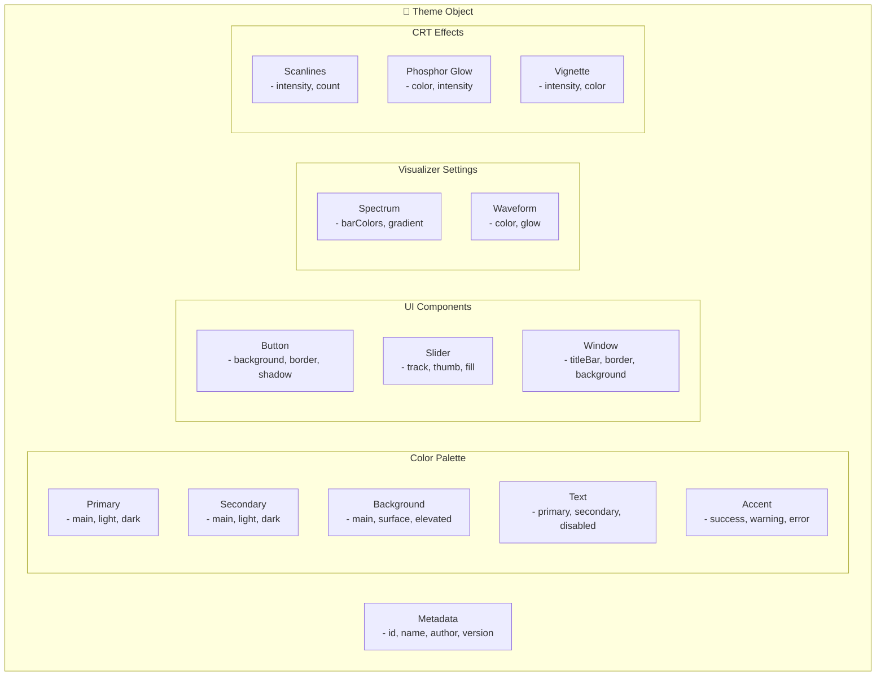

# Development Guide

```
╔══════════════════════════════════════════════════════════════════════════╗
║                         DEVELOPMENT GUIDE                                 ║
║                    « For Those About To Code, We Salute You »            ║
╚══════════════════════════════════════════════════════════════════════════╝
```

## 🚀 Getting Started

### Prerequisites

```bash
# Required versions
Node.js >= 18.0.0
npm >= 8.0.0
# or
yarn >= 1.22.0
# or
pnpm >= 7.0.0
```

### Installation Steps

```bash
# 1. Clone the repository
git clone https://github.com/username/app-winamp-viz.git
cd app-winamp-viz

# 2. Install dependencies
npm install

# 3. Verify installation
npm run verify

# 4. Start development server
npm run dev
```

### Project Structure

```
app-winamp-viz/
├── src/                    # Source code
│   ├── core/              # Core systems (audio, events, state)
│   ├── visualizers/       # Visualizer implementations
│   ├── audio/             # Audio processing
│   ├── rendering/         # WebGL/Three.js rendering
│   ├── themes/            # Theme system
│   ├── ui/                # UI components
│   ├── types/             # TypeScript types
│   └── utils/             # Utilities
├── tests/                 # Test suite
├── docs/                  # Documentation
├── themes/                # Custom theme files
└── public/                # Static assets
```

## 🏗️ Architecture Deep Dive

### Core Systems



### Visualizer System



### Event System



## 📝 How to Add a New Visualizer

### Step-by-Step Guide



### Example: Creating a "Plasma" Visualizer

```typescript
// src/visualizers/PlasmaVisualizer.ts

import { BaseVisualizer } from './BaseVisualizer';
import { AudioData } from '../audio/AudioData';
import { Theme } from '../themes/Theme';
import * as THREE from 'three';

export interface PlasmaConfig {
  resolution: number;
  speed: number;
  colorShift: boolean;
}

export class PlasmaVisualizer extends BaseVisualizer {
  private plasmaMesh: THREE.Mesh;
  private plasmaMaterial: THREE.ShaderMaterial;
  private uniforms: {
    time: { value: number };
    audioLow: { value: number };
    audioMid: { value: number };
    audioHigh: { value: number };
    color1: { value: THREE.Color };
    color2: { value: THREE.Color };
  };

  constructor(config: PlasmaConfig) {
    super({
      id: 'plasma',
      name: 'Plasma',
      config,
    });
  }

  async initialize(): Promise<void> {
    // Create shader uniforms
    this.uniforms = {
      time: { value: 0 },
      audioLow: { value: 0 },
      audioMid: { value: 0 },
      audioHigh: { value: 0 },
      color1: { value: new THREE.Color(0x00ff00) },
      color2: { value: new THREE.Color(0xff00ff) },
    };

    // Create shader material
    this.plasmaMaterial = new THREE.ShaderMaterial({
      uniforms: this.uniforms,
      vertexShader: await this.loadShader('plasma.vert'),
      fragmentShader: await this.loadShader('plasma.frag'),
    });

    // Create full-screen quad
    const geometry = new THREE.PlaneGeometry(2, 2);
    this.plasmaMesh = new THREE.Mesh(geometry, this.plasmaMaterial);
    this.scene.add(this.plasmaMesh);
  }

  update(audioData: AudioData): void {
    // Analyze frequency bands
    const bands = this.analyzeFrequencyBands(audioData.frequencyData);
    
    // Update uniforms based on audio
    this.uniforms.audioLow.value = bands.low / 255;
    this.uniforms.audioMid.value = bands.mid / 255;
    this.uniforms.audioHigh.value = bands.high / 255;
  }

  render(deltaTime: number): void {
    // Update time uniform for animation
    this.uniforms.time.value += deltaTime;
    
    // Render to canvas
    this.renderer.render(this.scene, this.camera);
  }

  dispose(): void {
    // Clean up resources
    this.plasmaGeometry.dispose();
    this.plasmaMaterial.dispose();
    this.scene.remove(this.plasmaMesh);
  }

  setTheme(theme: Theme): void {
    // Update colors based on theme
    this.uniforms.color1.value.set(theme.colors.primary);
    this.uniforms.color2.value.set(theme.colors.secondary);
  }

  private analyzeFrequencyBands(data: Uint8Array): { low: number; mid: number; high: number } {
    // Divide frequency data into 3 bands
    const third = Math.floor(data.length / 3);
    
    return {
      low: this.average(data.slice(0, third)),
      mid: this.average(data.slice(third, third * 2)),
      high: this.average(data.slice(third * 2)),
    };
  }

  private average(arr: Uint8Array): number {
    return arr.reduce((a, b) => a + b, 0) / arr.length;
  }

  private async loadShader(name: string): Promise<string> {
    const response = await fetch(`/shaders/${name}`);
    return response.text();
  }
}
```

### GLSL Shader Example

```glsl
// src/rendering/shaders/plasma.frag

uniform float time;
uniform float audioLow;
uniform float audioMid;
uniform float audioHigh;
uniform vec3 color1;
uniform vec3 color2;

varying vec2 vUv;

void main() {
  vec2 p = vUv * 2.0 - 1.0;
  
  // Classic plasma effect
  float v = 0.0;
  v += sin(p.x * 10.0 + time);
  v += sin(p.y * 10.0 + time * 0.5);
  v += sin((p.x + p.y) * 10.0 + time * 0.7);
  v += sin(sqrt(p.x * p.x + p.y * p.y) * 20.0 + time);
  
  // Modulate with audio
  v += audioLow * sin(p.x * 5.0);
  v += audioMid * cos(p.y * 5.0);
  v *= 1.0 + audioHigh;
  
  // Map to colors
  vec3 color = mix(color1, color2, sin(v) * 0.5 + 0.5);
  
  gl_FragColor = vec4(color, 1.0);
}
```

### Registration

```typescript
// src/visualizers/index.ts

import { VisualizerManager } from './VisualizerManager';
import { SpectrumAnalyzer } from './SpectrumAnalyzer';
import { Oscilloscope } from './Oscilloscope';
import { MilkdropRenderer } from './MilkdropRenderer';
import { VUMeter } from './VUMeter';
import { PlasmaVisualizer } from './PlasmaVisualizer'; // Add this

export function createVisualizerManager(): VisualizerManager {
  const manager = new VisualizerManager();
  
  // Register all visualizers
  manager.register(new SpectrumAnalyzer());
  manager.register(new Oscilloscope());
  manager.register(new MilkdropRenderer());
  manager.register(new VUMeter());
  manager.register(new PlasmaVisualizer({    // Add this
    resolution: 512,
    speed: 1.0,
    colorShift: true,
  }));
  
  return manager;
}
```

## 🎨 How to Create a Theme

### Theme Structure



### Example Theme

```typescript
// themes/cyber-neon.ts

import { Theme } from '../src/themes/Theme';

export const cyberNeonTheme: Theme = {
  id: 'cyber-neon',
  name: 'Cyber Neon',
  author: 'Your Name',
  version: '1.0.0',
  
  colors: {
    primary: {
      main: '#FF00FF',      // Hot pink
      light: '#FF69B4',     // Light pink
      dark: '#C71585',      // Medium violet red
    },
    secondary: {
      main: '#00FFFF',      // Cyan
      light: '#E0FFFF',     // Light cyan
      dark: '#00CED1',      // Dark turquoise
    },
    background: {
      main: '#0a0a0f',      // Near black
      surface: '#14141f',   // Dark blue-black
      elevated: '#1f1f2e', // Slightly lighter
    },
    text: {
      primary: '#ffffff',
      secondary: '#b0b0b0',
      disabled: '#606060',
    },
    accent: {
      success: '#00ff00',
      warning: '#ffff00',
      error: '#ff0000',
    },
  },
  
  typography: {
    fontFamily: 'Courier New, monospace',
    sizes: {
      xs: '10px',
      sm: '12px',
      md: '14px',
      lg: '16px',
      xl: '20px',
    },
  },
  
  ui: {
    button: {
      borderRadius: '0px',
      borderWidth: '2px',
      shadow: '4px 4px 0px #FF00FF',
    },
    slider: {
      trackHeight: '4px',
      thumbSize: '12px',
    },
    window: {
      titleBarHeight: '24px',
      borderWidth: '2px',
    },
  },
  
  visualizer: {
    spectrum: {
      barCount: 64,
      useGradient: true,
      gradientColors: ['#FF00FF', '#00FFFF', '#00FF00'],
    },
    waveform: {
      color: '#00FFFF',
      glow: 10,
      lineWidth: 2,
    },
  },
  
  crt: {
    scanlines: {
      enabled: true,
      intensity: 0.3,
      count: 480,
    },
    phosphor: {
      enabled: true,
      color: '#00FFFF',
      intensity: 0.5,
    },
    vignette: {
      enabled: true,
      intensity: 0.4,
      color: '#000000',
    },
    curvature: {
      enabled: true,
      amount: 0.1,
    },
  },
};
```

### Registration

```typescript
// src/themes/presets/index.ts

import { winampDefault } from './winamp-default';
import { wmpClassic } from './wmp-classic';
import { terminalGreen } from './terminal-green';
import { cyberNeon } from './cyber-neon'; // Add this

export const builtInThemes = [
  winampDefault,
  wmpClassic,
  terminalGreen,
  cyberNeon, // Add this
];
```

## 🧪 Testing Guide

### Running Tests

```bash
# All tests
npm test

# Watch mode
npm test -- --watch

# Specific file
npm test -- tests/unit/visualizers/spectrum.test.ts

# With coverage
npm run test:coverage

# E2E tests
npm run test:e2e
```

### Writing Tests

```typescript
// tests/unit/visualizers/spectrum.test.ts

import { describe, it, expect, beforeEach, vi } from 'vitest';
import { SpectrumAnalyzer } from '../../../src/visualizers/SpectrumAnalyzer';
import { createMockAudioData } from '../../utils/test-helpers';

describe('SpectrumAnalyzer', () => {
  let analyzer: SpectrumAnalyzer;
  
  beforeEach(() => {
    analyzer = new SpectrumAnalyzer({
      barCount: 32,
      fftSize: 2048,
    });
  });
  
  it('should initialize with correct configuration', () => {
    expect(analyzer.id).toBe('spectrum');
    expect(analyzer.barCount).toBe(32);
  });
  
  it('should update bars based on audio data', () => {
    const audioData = createMockAudioData({
      frequencyData: new Uint8Array(1024).fill(128),
    });
    
    analyzer.update(audioData);
    
    // Verify bars updated
    const bars = analyzer.getBars();
    expect(bars.length).toBe(32);
    expect(bars[0].scale.y).toBeGreaterThan(0);
  });
  
  it('should apply smoothing to prevent jitter', () => {
    const data1 = createMockAudioData({
      frequencyData: new Uint8Array(1024).fill(255),
    });
    const data2 = createMockAudioData({
      frequencyData: new Uint8Array(1024).fill(0),
    });
    
    analyzer.update(data1);
    const height1 = analyzer.getBarHeight(0);
    
    analyzer.update(data2);
    const height2 = analyzer.getBarHeight(0);
    
    // Should smooth transition, not jump directly to 0
    expect(height2).toBeGreaterThan(0);
    expect(height2).toBeLessThan(height1);
  });
});
```

## 🐛 Debugging Tips

### WebGL Debugging

```bash
# Enable WebGL debug mode
DEBUG_WEBGL=true npm run dev

# Check WebGL support
npm run check-webgl
```

```typescript
// Enable Three.js debug mode
import { setDebugMode } from 'three';
setDebugMode(true);

// Check for shader compilation errors
renderer.compile(scene, camera);
```

### Audio Debugging

```typescript
// Log audio context state
console.log('AudioContext state:', audioContext.state);

// Visualize frequency data
const data = new Uint8Array(analyser.frequencyBinCount);
analyser.getByteFrequencyData(data);
console.log('Frequency data:', data.slice(0, 10));

// Check for silence
const average = data.reduce((a, b) => a + b) / data.length;
console.log('Average amplitude:', average);
```

### Performance Profiling

```typescript
// Measure frame time
const start = performance.now();
renderer.render(scene, camera);
const frameTime = performance.now() - start;
console.log(`Frame time: ${frameTime.toFixed(2)}ms`);

// Monitor FPS
let lastTime = performance.now();
let frames = 0;

function measureFPS() {
  frames++;
  const currentTime = performance.now();
  
  if (currentTime - lastTime >= 1000) {
    console.log(`FPS: ${frames}`);
    frames = 0;
    lastTime = currentTime;
  }
  
  requestAnimationFrame(measureFPS);
}
```

### Browser DevTools

1. **Three.js Inspector**: Install browser extension
2. **WebGL Inspector**: Use Spector.js
3. **Performance Tab**: Profile CPU/GPU usage
4. **Memory Tab**: Check for leaks
5. **Shader Editor**: Live edit GLSL shaders

## 📦 Build & Deployment

### Production Build

```bash
# Build for production
npm run build

# Preview production build
npm run preview
```

### Environment Variables

```bash
# .env.development
VITE_DEBUG_MODE=true
VITE_WEBGL_VERSION=2
VITE_FPS_LIMIT=60

# .env.production
VITE_DEBUG_MODE=false
VITE_WEBGL_VERSION=2
VITE_FPS_LIMIT=60
VITE_ENABLE_ANALYTICS=false
```

### Deployment

```bash
# Vercel
vercel --prod

# Netlify
netlify deploy --prod

# GitHub Pages
npm run deploy:gh-pages
```

## 🔧 Common Issues

### WebGL Context Lost

```typescript
// Handle context loss
renderer.domElement.addEventListener('webglcontextlost', (event) => {
  event.preventDefault();
  console.warn('WebGL context lost');
  // Save state, wait for restoration
});

renderer.domElement.addEventListener('webglcontextrestored', () => {
  console.log('WebGL context restored');
  // Reinitialize resources
  initialize();
});
```

### AudioContext Not Allowed

```typescript
// Must be triggered by user interaction
function resumeAudioContext() {
  if (audioContext.state === 'suspended') {
    audioContext.resume();
  }
}

// Add to all interactive elements
document.addEventListener('click', resumeAudioContext, { once: true });
```

## 📚 Resources

- [Three.js Documentation](https://threejs.org/docs/)
- [Web Audio API Guide](https://developer.mozilla.org/en-US/docs/Web/API/Web_Audio_API)
- [GLSL Reference](https://www.khronos.org/files/opengles_shading_language.pdf)
- [Winamp Skinning Guide](https://winamp.dev/help/winamp-skinning/)

---

```
╔══════════════════════════════════════════════════════════════════╗
║                                                                  ║
║  "The best code is code that never needs to be written."         ║
║                         - Ancient Developer Proverb              ║
╚══════════════════════════════════════════════════════════════════╝
```
