# Performance Optimization Guide

```
╔══════════════════════════════════════════════════════════════════════════╗
║                      PERFORMANCE OPTIMIZATION GUIDE                         ║
║                    « 60 FPS or Bust - No Exceptions »                    ║
╚══════════════════════════════════════════════════════════════════════════╝
```

## 🎯 Performance Targets

```mermaid
flowchart LR
    FPS["60 FPS Target\n16.67ms per frame"] --> Metrics
    
    subgraph Metrics["📊 Key Metrics"]
        CPU["CPU < 30%\nMain thread"]
        GPU["GPU < 50%\nFragment shaders"]
        Memory["Memory < 100MB\nHeap usage"]
        Battery["Battery\nEfficient"]
    end
```



## 🏎️ Rendering Pipeline Optimization

### Frame Budget

```
┌─────────────────────────────────────────────────────────────┐
│  16.67ms Total Frame Budget @ 60 FPS                        │
├─────────────────────────────────────────────────────────────┤
│  Audio Processing      │████████░░░░░░░░│  3ms  (18%)     │
│  Visualizer Update     │██████████░░░░░░│  4ms  (24%)     │
│  Three.js Render       │██████████░░░░░░│  4ms  (24%)     │
│  Post-Processing       │██████░░░░░░░░░░░│  2ms  (12%)     │
│  UI Updates            │███░░░░░░░░░░░░░│  1ms   (6%)     │
│  Buffer                │████░░░░░░░░░░░░│  2.67ms (16%)   │
└─────────────────────────────────────────────────────────────┘
```

### Rendering Architecture

```mermaid
flowchart TB
    subgraph Frame["📽️ Frame Pipeline"]
        Audio["Audio Update\n30fps"] --> Visualizer
        Visualizer["Visualizer\nProcess Data"] --> Render
        Render["Three.js Render\n60fps"] --> PostFX
        PostFX["Post-Processing\n60fps"] --> Display
    end
    
    subgraph Optimizations["⚡ Optimizations"]
        Decouple["Decouple Audio\nfrom Render Loop"]
        Throttle["Throttle Updates\nNot on Screen"]
        Instancing["Geometry Instancing\nSpectrum Bars"]
        FBO["Render Targets\nOff-screen Work"]
    end
    
    Frame --> Optimizations
```



## 🧠 Memory Management

### Object Pooling

```typescript
// src/utils/ObjectPool.ts

export class ObjectPool<T> {
  private pool: T[] = [];
  private createFn: () => T;
  private resetFn: (item: T) => void;
  private maxSize: number;

  constructor(
    createFn: () => T,
    resetFn: (item: T) => void,
    maxSize: number = 100
  ) {
    this.createFn = createFn;
    this.resetFn = resetFn;
    this.maxSize = maxSize;
  }

  acquire(): T {
    if (this.pool.length > 0) {
      return this.pool.pop()!;
    }
    return this.createFn();
  }

  release(item: T): void {
    if (this.pool.length < this.maxSize) {
      this.resetFn(item);
      this.pool.push(item);
    }
  }

  clear(): void {
    this.pool = [];
  }
}

// Usage for spectrum bars
const geometryPool = new ObjectPool<THREE.BoxGeometry>(
  () => new THREE.BoxGeometry(1, 1, 1),
  (geom) => geom.dispose(),
  256
);
```

### Texture Management

```typescript
// src/rendering/TextureCache.ts

export class TextureCache {
  private cache = new Map<string, THREE.Texture>();
  private maxCacheSize = 10;
  private accessOrder: string[] = [];

  get(key: string, loader: () => THREE.Texture): THREE.Texture {
    // Update access order
    const index = this.accessOrder.indexOf(key);
    if (index > -1) {
      this.accessOrder.splice(index, 1);
    }
    this.accessOrder.push(key);

    // Return cached or load new
    if (this.cache.has(key)) {
      return this.cache.get(key)!;
    }

    // Evict oldest if at capacity
    if (this.cache.size >= this.maxCacheSize) {
      const oldest = this.accessOrder.shift()!;
      const oldTexture = this.cache.get(oldest);
      if (oldTexture) {
        oldTexture.dispose();
        this.cache.delete(oldest);
      }
    }

    const texture = loader();
    this.cache.set(key, texture);
    return texture;
  }

  dispose(): void {
    this.cache.forEach(texture => texture.dispose());
    this.cache.clear();
    this.accessOrder = [];
  }
}
```

## 📊 Visualizer Optimizations

### Spectrum Analyzer

```typescript
// Optimized Spectrum Implementation
export class OptimizedSpectrum extends BaseVisualizer {
  private instancedMesh: THREE.InstancedMesh;
  private dummy = new THREE.Object3D();
  private barCount = 64;
  private lastUpdate = 0;
  private updateInterval = 1000 / 30; // 30fps update

  async initialize(): Promise<void> {
    // Create geometry once
    const geometry = new THREE.BoxGeometry(1, 1, 1);
    const material = new THREE.MeshBasicMaterial({ color: 0x00ff00 });
    
    // Use instanced mesh for performance
    this.instancedMesh = new THREE.InstancedMesh(
      geometry,
      material,
      this.barCount
    );
    
    this.scene.add(this.instancedMesh);
  }

  update(audioData: AudioData, timestamp: number): void {
    // Throttle updates to 30fps
    if (timestamp - this.lastUpdate < this.updateInterval) {
      return;
    }
    this.lastUpdate = timestamp;

    // Process frequency data
    const data = audioData.frequencyData;
    const step = Math.floor(data.length / this.barCount);

    for (let i = 0; i < this.barCount; i++) {
      // Average frequency values
      let sum = 0;
      for (let j = 0; j < step; j++) {
        sum += data[i * step + j];
      }
      const average = sum / step / 255;

      // Update instance transform
      this.dummy.position.set(i * 1.1 - this.barCount / 2, average / 2, 0);
      this.dummy.scale.set(1, average, 1);
      this.dummy.updateMatrix();
      this.instancedMesh.setMatrixAt(i, this.dummy.matrix);
    }

    this.instancedMesh.instanceMatrix.needsUpdate = true;
  }
}
```

### Buffer Reuse

```typescript
// src/audio/OptimizedAudioEngine.ts

export class OptimizedAudioEngine {
  private frequencyBuffer: Uint8Array;
  private timeDomainBuffer: Uint8Array;
  private analyser: AnalyserNode;

  constructor(fftSize: number = 2048) {
    // Pre-allocate buffers - don't recreate every frame
    this.analyser = this.context.createAnalyser();
    this.analyser.fftSize = fftSize;
    
    this.frequencyBuffer = new Uint8Array(this.analyser.frequencyBinCount);
    this.timeDomainBuffer = new Uint8Array(this.analyser.fftSize);
  }

  getAudioData(): AudioData {
    // Reuse buffers instead of creating new ones
    this.analyser.getByteFrequencyData(this.frequencyBuffer);
    this.analyser.getByteTimeDomainData(this.timeDomainBuffer);

    return {
      frequencyData: this.frequencyBuffer, // Same buffer, updated data
      timeDomainData: this.timeDomainBuffer,
      sampleRate: this.context.sampleRate,
      timestamp: performance.now(),
    };
  }
}
```

## 🎨 WebGL Optimizations

### Efficient Shaders

```glsl
// Good: Minimal branching, precompute uniforms
uniform float time;
uniform vec3 color;
uniform float intensity;

varying vec2 vUv;

void main() {
  // Precompute common values
  float t = time * 0.5;
  vec2 p = vUv * 2.0 - 1.0;
  
  // Avoid if/else in shaders when possible
  float wave = sin(p.x * 10.0 + t) * 0.5 + 0.5;
  float wave2 = cos(p.y * 10.0 - t) * 0.5 + 0.5;
  
  // Mix with smoothstep instead of conditionals
  float blend = smoothstep(0.0, 1.0, wave * wave2);
  
  vec3 finalColor = mix(color * 0.5, color, blend) * intensity;
  
  gl_FragColor = vec4(finalColor, 1.0);
}
```

### Shader Compilation Caching

```typescript
// src/rendering/ShaderCache.ts

export class ShaderCache {
  private programs = new Map<string, THREE.ShaderMaterial>();

  getMaterial(
    vertexShader: string,
    fragmentShader: string,
    uniforms: Record<string, THREE.IUniform>
  ): THREE.ShaderMaterial {
    const key = this.hashShaders(vertexShader, fragmentShader);
    
    if (this.programs.has(key)) {
      return this.programs.get(key)!;
    }

    const material = new THREE.ShaderMaterial({
      vertexShader,
      fragmentShader,
      uniforms,
    });

    this.programs.set(key, material);
    return material;
  }

  private hashShaders(vs: string, fs: string): string {
    // Simple hash for caching
    return btoa(`${vs.length}:${fs.length}:${vs.slice(0, 100)}`);
  }
}
```

## 📱 Responsive Performance

### Adaptive Quality

```typescript
// src/utils/AdaptiveQuality.ts

export class AdaptiveQuality {
  private targetFPS = 60;
  private frameTimes: number[] = [];
  private qualityLevel = 3; // 0-4 scale
  
  private qualitySettings = [
    { fftSize: 512,  barCount: 16,  particles: 100 },  // Low
    { fftSize: 1024, barCount: 32,  particles: 500 },  // Medium
    { fftSize: 2048, barCount: 64,  particles: 1000 }, // High
    { fftSize: 4096, barCount: 128, particles: 2000 }, // Ultra
    { fftSize: 8192, barCount: 256, particles: 5000 }, // Extreme
  ];

  recordFrameTime(frameTime: number): void {
    this.frameTimes.push(frameTime);
    
    // Keep last 60 frames
    if (this.frameTimes.length > 60) {
      this.frameTimes.shift();
    }

    // Adjust quality every 60 frames
    if (this.frameTimes.length === 60) {
      this.adjustQuality();
    }
  }

  private adjustQuality(): void {
    const avgFrameTime = this.frameTimes.reduce((a, b) => a + b) / 60;
    const currentFPS = 1000 / avgFrameTime;

    if (currentFPS < this.targetFPS * 0.9 && this.qualityLevel > 0) {
      // Performance dropping, reduce quality
      this.qualityLevel--;
      console.log(`Reducing quality to level ${this.qualityLevel}`);
    } else if (currentFPS > this.targetFPS * 1.1 && this.qualityLevel < 4) {
      // Performance good, can increase quality
      this.qualityLevel++;
      console.log(`Increasing quality to level ${this.qualityLevel}`);
    }

    this.frameTimes = [];
  }

  getCurrentSettings() {
    return this.qualitySettings[this.qualityLevel];
  }
}
```

### Level of Detail (LOD)

```typescript
// LOD for Milkdrop particles
export class LODParticleSystem extends BaseVisualizer {
  private particleCounts = [5000, 2000, 1000, 500, 100];
  private currentLOD = 2;

  setLOD(distance: number): void {
    // Adjust particle count based on "distance" or performance
    const newLOD = Math.min(
      Math.floor(distance / 100),
      this.particleCounts.length - 1
    );

    if (newLOD !== this.currentLOD) {
      this.currentLOD = newLOD;
      this.rebuildParticleSystem(this.particleCounts[newLOD]);
    }
  }

  private rebuildParticleSystem(count: number): void {
    // Dispose old
    this.particleSystem.geometry.dispose();
    
    // Create new with fewer particles
    const geometry = new THREE.BufferGeometry();
    const positions = new Float32Array(count * 3);
    // ... populate positions
    
    geometry.setAttribute('position', new THREE.BufferAttribute(positions, 3));
    this.particleSystem.geometry = geometry;
  }
}
```

## 🔧 Profiling Tools

### Performance Monitor

```typescript
// src/utils/PerformanceMonitor.ts

export class PerformanceMonitor {
  private metrics = {
    fps: 0,
    frameTime: 0,
    drawCalls: 0,
    triangles: 0,
    memory: 0,
  };

  private renderer: THREE.WebGLRenderer;
  private info: THREE.WebGLInfo;

  constructor(renderer: THREE.WebGLRenderer) {
    this.renderer = renderer;
    this.info = renderer.info;
  }

  update(): void {
    this.metrics.drawCalls = this.info.render.calls;
    this.metrics.triangles = this.info.render.triangles;
    this.metrics.memory = this.info.memory.geometries;
  }

  getMetrics() {
    return { ...this.metrics };
  }

  log(): void {
    console.table({
      'FPS': this.metrics.fps.toFixed(1),
      'Frame Time (ms)': this.metrics.frameTime.toFixed(2),
      'Draw Calls': this.metrics.drawCalls,
      'Triangles': this.metrics.triangles.toLocaleString(),
      'Memory (MB)': (this.metrics.memory / 1024 / 1024).toFixed(2),
    });
  }
}
```

### DevTools Integration

```typescript
// Enable Three.js inspector
if (process.env.NODE_ENV === 'development') {
  // Spector.js for WebGL debugging
  const SPECTOR = require('spectorjs');
  const spector = new SPECTOR.Spector();
  spector.displayUI();

  // Stats.js for FPS counter
  const Stats = require('stats.js');
  const stats = new Stats();
  stats.showPanel(0); // 0: fps, 1: ms, 2: mb, 3+: custom
  document.body.appendChild(stats.dom);

  // Update in render loop
  function animate() {
    stats.begin();
    renderer.render(scene, camera);
    stats.end();
    requestAnimationFrame(animate);
  }
}
```

## 📈 Performance Checklist

### Before Release

```
□ 60 FPS maintained consistently
□ No memory leaks (monitor heap for 10+ minutes)
□ Bundle size < 500KB (gzipped)
□ First paint < 1 second
□ Time to interactive < 2 seconds
□ Works on low-end devices (reduce quality)
□ Battery usage acceptable (monitor)
□ No jank or frame drops
□ Responsive to user input (< 100ms)
□ Proper disposal of all resources
```

### Optimization Priorities

```
HIGH IMPACT | LOW EFFORT          ████████████ Priority 1
HIGH IMPACT | HIGH EFFORT         ████████░░░░ Priority 2
LOW IMPACT  | LOW EFFORT          ████░░░░░░░░ Priority 3
LOW IMPACT  | HIGH EFFORT         ░░░░░░░░░░░░ Skip
```

## 🚀 Performance Tips

### 1. **Use requestAnimationFrame correctly**
```typescript
// Good
function animate() {
  requestAnimationFrame(animate);
  render();
}

// Bad - can cause frame drops
setInterval(render, 16);
```

### 2. **Batch matrix updates**
```typescript
// Good - update once per frame
mesh.updateMatrix();
mesh.matrixAutoUpdate = false;

// Bad - updates every frame even if not changed
// (matrixAutoUpdate = true is default)
```

### 3. **Use appropriate pixel ratio**
```typescript
// Limit pixel ratio for performance
const pixelRatio = Math.min(window.devicePixelRatio, 2);
renderer.setPixelRatio(pixelRatio);
```

### 4. **Avoid blocking the main thread**
```typescript
// Offload heavy work to workers
const worker = new Worker('audio-processor.js');
worker.postMessage({ fftData }, [fftData.buffer]);
```

---

```
╔══════════════════════════════════════════════════════════════════╗
║                                                                  ║
║  "Premature optimization is the root of all evil...              ║
║   ...but slow code is evil too."                                 ║
║                                        - Every Developer Ever    ║
╚══════════════════════════════════════════════════════════════════╝
```
