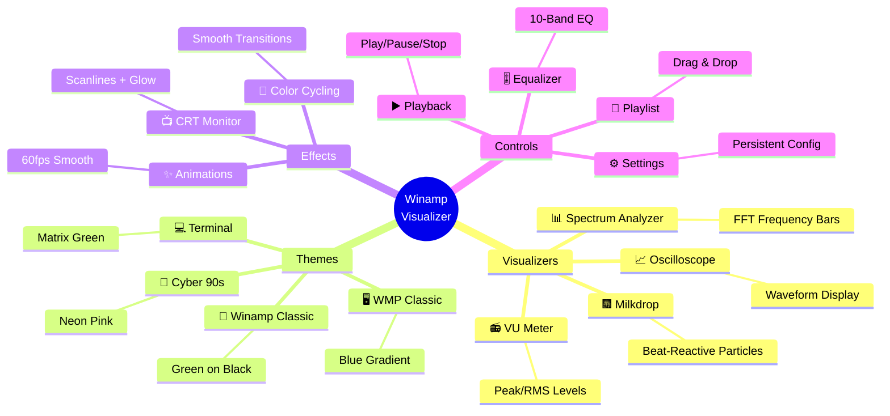
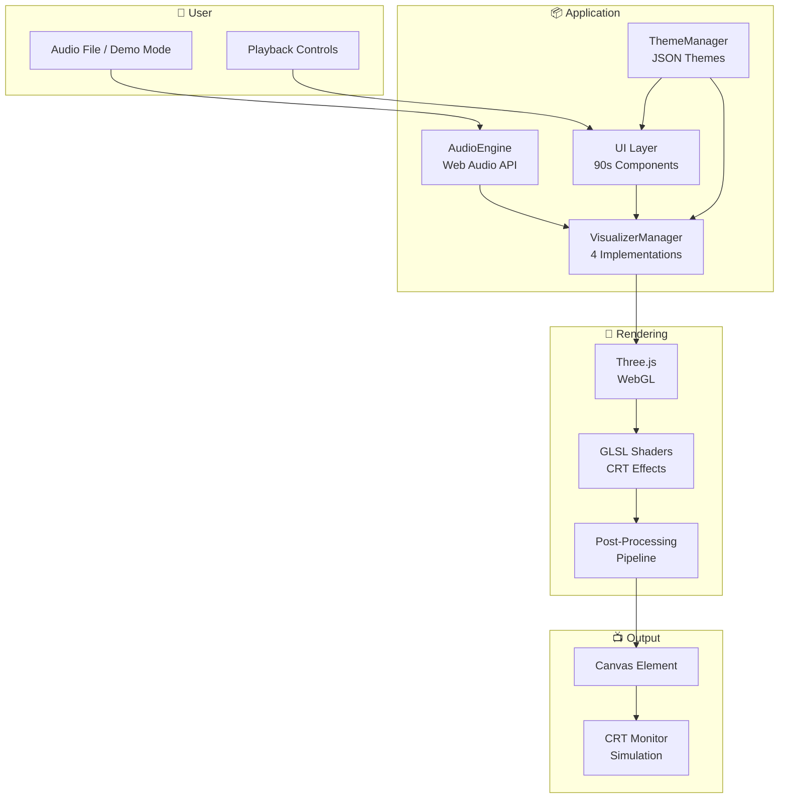

# 90s Winamp Visualizer

```
╔══════════════════════════════════════════════════════════════════════════╗
║                                                                          ║
║     ██╗    ██╗██╗███╗   ██╗ █████╗ ███╗   ███╗██████╗                    ║
║     ██║    ██║██║████╗  ██║██╔══██╗████╗ ████║██╔══██╗                   ║
║     ██║ █╗ ██║██║██╔██╗ ██║███████║██╔████╔██║██████╔╝                   ║
║     ██║███╗██║██║██║╚██╗██║██╔══██║██║╚██╔╝██║██╔═══╝                    ║
║     ╚███╔███╔╝██║██║ ╚████║██║  ██║██║ ╚═╝ ██║██║                        ║
║      ╚══╝╚══╝ ╚═╝╚═╝  ╚═══╝╚═╝  ╚═╝╚═╝     ╚═╝╚═╝                        ║
║                                                                          ║
║              V I S U A L I Z E R   S Y S T E M                          ║
║                                                                          ║
║                   [  T H E   C L A S S I C   R E T U R N S  ]             ║
║                                                                          ║
╚══════════════════════════════════════════════════════════════════════════╝
```

> **"It really whips the llama's ass!"** - Reimagined for the modern web.

A faithful recreation of the legendary Winamp visualizer experience, built with modern web technologies. Powered by Three.js, TypeScript, and the Web Audio API.

## ✨ Features



### 🎨 Visualizers

1. **Spectrum Analyzer** - Classic FFT frequency bars with customizable count (32-256 bars)
2. **Oscilloscope** - Real-time waveform display with adjustable time window
3. **Milkdrop Renderer** - Beat-reactive particle system with preset transitions
4. **VU Meter** - Professional peak/RMS meter with configurable hold time

### 🖥️ Authentic 90s Aesthetic

- **CRT Monitor Effects**: Scanlines, phosphor glow, screen curvature
- **Bitmap Typography**: Pixel-perfect fonts from the era
- **Color Palettes**: Classic Winamp green (#00FF00), WMP blue, Matrix terminal
- **Skeuomorphic Controls**: 3D buttons, sliders with realistic shadows
- **Easter Eggs**: Secret key combinations and nostalgic surprises

### 🎵 Audio Support

- **Web Audio API**: Full browser-native audio processing
- **Demo Mode**: Synthetic audio generation (no files needed)
- **Drag & Drop**: Easy file loading
- **Playlist Management**: Queue, shuffle, repeat modes

## 🚀 Quick Start

### Installation

```bash
# Clone the repository
git clone https://github.com/username/app-winamp-viz.git
cd app-winamp-viz

# Install dependencies
npm install

# Start development server
npm run dev
```

### Usage

```bash
# Development mode with hot reload
npm run dev

# Build for production
npm run build

# Run tests
npm test

# Run tests with coverage
npm run test:coverage

# Lint code
npm run lint

# Format code
npm run format
```

### Open in Browser

```
http://localhost:5173
```

## 🏗️ Architecture Overview



## 📊 System Requirements

### Minimum
- **Browser**: Chrome 90+, Firefox 88+, Safari 14+, Edge 90+
- **WebGL**: Version 2.0 support required
- **Memory**: 4GB RAM
- **CPU**: Dual-core processor

### Recommended
- **Browser**: Latest stable version
- **GPU**: Dedicated graphics with WebGL 2.0
- **Memory**: 8GB+ RAM
- **Display**: 1080p or higher for best CRT effect

## 🎨 Built-in Themes

### Winamp Classic
```
┌────────────────────────────────┐
│  ████████████████████████████ │
│  ██  WINAMP  █  ▁▂▃▄▅▆▇█   ██ │
│  ██  ▓▓▓▓▓▓▓▓▓▓▓▓▓▓▓▓▓▓▓▓  ██ │
│  ██  ▓ GREEN ON BLACK  ▓  ██ │
│  ██  ▓▓▓▓▓▓▓▓▓▓▓▓▓▓▓▓▓▓▓▓  ██ │
│  ████████████████████████████ │
└────────────────────────────────┘
```

### Windows Media Player
```
┌────────────────────────────────┐
│  ░░░░░░░░░░░░░░░░░░░░░░░░░░░ │
│  ░  WMP CLASSIC  ░  ▁▂▃▄▅▆  ░ │
│  ░  ▒▒▒▒▒▒▒▒▒▒▒▒▒▒▒▒▒▒▒▒  ░ │
│  ░  ▒ BLUE GRADIENT  ▒▒  ░ │
│  ░  ▒▒▒▒▒▒▒▒▒▒▒▒▒▒▒▒▒▒▒▒  ░ │
│  ░░░░░░░░░░░░░░░░░░░░░░░░░░░ │
└────────────────────────────────┘
```

### Terminal Green
```
┌────────────────────────────────┐
│  ╔══════════════════════════╗ │
│  ║  TERMINAL.EXE  [▀▄▄▄▀]   ║ │
│  ║  ▓▓▓▓▓▓▓▓▓▓▓▓▓▓▓▓▓▓▓▓  ║ │
│  ║  ▓ MATRIX GREEN  ▓▓▓▓  ║ │
│  ║  ▓▓▓▓▓▓▓▓▓▓▓▓▓▓▓▓▓▓▓▓  ║ │
│  ╚══════════════════════════╝ │
└────────────────────────────────┘
```

### Cyber 90s
```
┌────────────────────────────────┐
│  ████████████████████████████ │
│  ██  CYBER.EXE  █ ▓▒░▒▓    ██ │
│  ██  ▓▒░ NEON PINK ░▒▓   ██ │
│  ██  ▓▒░▒▓▒░▒▓▒░▒▓▒░▒▓  ██ │
│  ██  ░▒▓░▒▓░▒▓░▒▓░▒▓░▒  ██ │
│  ████████████████████████████ │
└────────────────────────────────┘
```

## 🖼️ Screenshots

> **Note**: Screenshots will be added once visualizers are implemented.

```
┌──────────────────────────────────────────────────────────┐
│  [SCREENSHOT PLACEHOLDER: Spectrum Analyzer Classic]      │
│  256 frequency bars reacting to synthetic audio          │
│  Green bars on black background with CRT scanlines       │
└──────────────────────────────────────────────────────────┘

┌──────────────────────────────────────────────────────────┐
│  [SCREENSHOT PLACEHOLDER: Oscilloscope Display]          │
│  Real-time waveform visualization with time window       │
│  Phosphor glow effect simulating CRT monitor             │
└──────────────────────────────────────────────────────────┘

┌──────────────────────────────────────────────────────────┐
│  [SCREENSHOT PLACEHOLDER: Milkdrop Beat Visualizer]      │
│  Particle explosion synchronized with beat detection     │
│  Smooth preset transitions and color cycling               │
└──────────────────────────────────────────────────────────┘
```

## 📚 Documentation

- **[ARCHITECTURE.md](./ARCHITECTURE.md)** - System architecture with Mermaid diagrams
- **[DEVELOPMENT.md](./DEVELOPMENT.md)** - Developer guide and contribution instructions
- **[UI_UX_DESIGN.md](./UI_UX_DESIGN.md)** - 90s aesthetic specifications
- **[THEMES.md](./THEMES.md)** - Theme system documentation
- **[VISUALIZERS.md](./VISUALIZERS.md)** - Visualizer algorithms and customization
- **[SECURITY.md](./SECURITY.md)** - Security considerations and threat model
- **[PERFORMANCE.md](./PERFORMANCE.md)** - Performance optimization guide
- **[CODE_QUALITY.md](./CODE_QUALITY.md)** - Code standards and best practices

## 🧪 Testing

```bash
# Run all tests
npm test

# Run with coverage
npm run test:coverage

# Run specific test file
npm test -- tests/unit/visualizers/spectrum.test.ts

# Run in watch mode
npm test -- --watch

# Run e2e tests
npm run test:e2e
```

### Test Structure

```
tests/
├── setup.ts                    # Vitest configuration
├── mocks/
│   ├── webgl.ts               # WebGL/Three.js mocks
│   └── webaudio.ts            # Web Audio API mocks
├── unit/
│   ├── visualizers/           # Visualizer unit tests
│   ├── audio/                 # Audio engine tests
│   └── ui/                    # UI component tests
├── integration/               # Integration tests
└── e2e/                       # End-to-end tests
```

## 🤝 Contributing

We welcome contributions! Please see [DEVELOPMENT.md](./DEVELOPMENT.md) for:

- Setting up your development environment
- Code style guidelines
- How to add new visualizers
- How to create themes
- Testing requirements

## 📝 License

MIT License - See [LICENSE](./LICENSE) file for details.

## 🙏 Acknowledgments

- **Nullsoft** - Creators of the original Winamp
- **Justin Frankel** - For making "it really whip the llama's ass"
- **Three.js Community** - For the excellent WebGL library
- **90s UI Design** - For the aesthetic that never goes out of style

## 🔗 Links

- **Live Demo**: [https://winamp-viz-demo.vercel.app](https://winamp-viz-demo.vercel.app) (coming soon)
- **Documentation**: [https://winamp-viz-docs.vercel.app](https://winamp-viz-docs.vercel.app) (coming soon)
- **Issues**: [GitHub Issues](https://github.com/username/app-winamp-viz/issues)
- **Discussions**: [GitHub Discussions](https://github.com/username/app-winamp-viz/discussions)

---

```
╔══════════════════════════════════════════════════════════════════╗
║                                                                  ║
║        Thanks for checking out this project!                      ║
║                                                                  ║
║        Now playing: "The Code Never Dies.mp3"                    ║
║        ━━━━━━━━━━━━━━━━━━━━━━●━━━━━━━  3:42 / 4:20               ║
║                                                                  ║
║        [⏮] [⏯] [⏹] [⏭]  ▁▂▃▄▅▆▇█  VOL: ████████░░              ║
║                                                                  ║
╚══════════════════════════════════════════════════════════════════╝
```

## 🎵 Keyboard Shortcuts

| Key | Action |
|-----|--------|
| `Space` | Play/Pause |
| `→` | Next Visualizer |
| `←` | Previous Visualizer |
| `↑` | Volume Up |
| `↓` | Volume Down |
| `M` | Toggle Mute |
| `F` | Toggle Fullscreen |
| `T` | Cycle Themes |
| `Ctrl + D` | Toggle Demo Mode |
| `Ctrl + O` | Open File |
| `Esc` | Exit Fullscreen / Close Modal |

---

**Made with 💚 and nostalgia for the 90s.**
