# Security Documentation

```
╔══════════════════════════════════════════════════════════════════════════╗
║                           SECURITY DOCUMENTATION                          ║
║                    « Trust but Verify, Then Verify Again »                ║
╚══════════════════════════════════════════════════════════════════════════╝
```

## 🔒 Threat Model

```mermaid
flowchart TB
    subgraph Threats["🎯 Threat Categories"]
        WebGL["WebGL Attacks\n- Shader exploits\n- GPU memory leaks\n- Context exhaustion"]
        
        Audio["Audio Attacks\n- Autoplay abuse\n- Resource exhaustion\n- Frequency attacks"]
        
        File["File Processing\n- Malicious audio files\n- Path traversal\n- DoS via large files"]
        
        Browser["Browser Attacks\n- XSS via themes\n- Data exfiltration\n- Clickjacking"]
    end
    
    subgraph Mitigations["🛡️ Mitigations"]
        CSP["Content Security Policy\n- No inline scripts\n- Restricted eval()\n- Limited external resources"]
        
        WebGLSec["WebGL Security\n- Context limits\n- Shader validation\n- Resource disposal"]
        
        AudioSec["Audio Security\n- User interaction required\n- Resource limits\n- Timeout protection"]
        
        InputVal["Input Validation\n- File type whitelist\n- Size limits\n- Path sanitization"]
    end
    
    Threats --> Mitigations
```



## 🛡️ Content Security Policy (CSP)

### Recommended CSP Headers

```http
Content-Security-Policy: 
  default-src 'self';
  script-src 'self' 'unsafe-inline' 'unsafe-eval';
  style-src 'self' 'unsafe-inline';
  img-src 'self' blob: data:;
  media-src 'self' blob:;
  connect-src 'self';
  font-src 'self';
  worker-src 'self' blob:;
  manifest-src 'self';
  frame-ancestors 'none';
  base-uri 'self';
  form-action 'self';
```

### Vite Configuration

```typescript
// vite.config.ts
export default defineConfig({
  server: {
    headers: {
      'Content-Security-Policy': [
        "default-src 'self'",
        "script-src 'self' 'unsafe-inline'",
        "style-src 'self' 'unsafe-inline'",
        "img-src 'self' blob: data:",
        "media-src 'self' blob:",
        "connect-src 'self'",
        "worker-src 'self' blob:",
      ].join('; '),
      'X-Frame-Options': 'DENY',
      'X-Content-Type-Options': 'nosniff',
      'Referrer-Policy': 'strict-origin-when-cross-origin',
    },
  },
});
```

## 🔐 WebGL Security

### Context Management

```typescript
// src/rendering/SecureRenderer.ts

export class SecureRenderer {
  private maxContexts = 4;
  private activeContexts = 0;
  private disposed = false;

  constructor() {
    this.validateContextLimit();
  }

  private validateContextLimit(): void {
    if (this.activeContexts >= this.maxContexts) {
      throw new Error(
        `Maximum WebGL contexts (${this.maxContexts}) exceeded. ` +
        'Dispose unused contexts before creating new ones.'
      );
    }
    this.activeContexts++;
  }

  dispose(): void {
    if (this.disposed) return;
    
    // Properly dispose all WebGL resources
    this.renderer.dispose();
    this.geometry.dispose();
    this.materials.forEach(m => m.dispose());
    this.textures.forEach(t => t.dispose());
    
    // Lose context
    const gl = this.canvas.getContext('webgl2');
    if (gl) {
      const loseContext = gl.getExtension('WEBGL_lose_context');
      if (loseContext) {
        loseContext.loseContext();
      }
    }
    
    this.activeContexts--;
    this.disposed = true;
  }
}
```

### Shader Validation

```typescript
// src/rendering/ShaderValidator.ts

export class ShaderValidator {
  // Prohibited GLSL patterns
  private static prohibitedPatterns = [
    /\binfinite\s+loop\b/i,
    /\bwhile\s*\(\s*true\s*\)/i,
    /\bfor\s*\(\s*;\s*;\s*\)/i,
    /\bdiscard\b.*\bdiscard\b/i, // Multiple discards
    /\btexture2D\s*\([^)]*\)\s*.*\btexture2D\s*\(/i, // Nested texture calls
  ];

  static validateShader(shaderSource: string): void {
    // Check for prohibited patterns
    for (const pattern of this.prohibitedPatterns) {
      if (pattern.test(shaderSource)) {
        throw new Error(`Shader contains prohibited pattern: ${pattern}`);
      }
    }

    // Check for excessive complexity
    const lineCount = shaderSource.split('\n').length;
    if (lineCount > 1000) {
      throw new Error(`Shader exceeds maximum line count: ${lineCount} > 1000`);
    }

    // Validate all texture uniforms are declared
    const textureMatches = shaderSource.match(/\btexture2D\s*\(\s*(\w+)/g);
    if (textureMatches) {
      const uniforms = shaderSource.match(/uniform\s+sampler2D\s+(\w+)/g);
      if (!uniforms || uniforms.length === 0) {
        throw new Error('Shader uses textures but declares no sampler2D uniforms');
      }
    }
  }
}
```

## 🎵 Audio Security

### Audio Context Management

```typescript
// src/audio/SecureAudioEngine.ts

export class SecureAudioEngine {
  private context: AudioContext | null = null;
  private maxSources = 2; // Limit concurrent sources
  private activeSources = 0;
  private resourceTimeout: number | null = null;
  private readonly RESOURCE_TIMEOUT_MS = 30000; // 30 seconds

  async initialize(): Promise<void> {
    // Audio context must be created in response to user interaction
    if (!this.isUserInteraction) {
      throw new Error('AudioContext can only be created after user interaction');
    }

    this.context = new AudioContext({
      latencyHint: 'interactive',
      sampleRate: 48000, // Standard rate, prevents exotic attacks
    });

    // Set resource timeout
    this.setResourceTimeout();
  }

  private setResourceTimeout(): void {
    this.resourceTimeout = window.setTimeout(() => {
      this.suspendContext();
      console.warn('Audio context suspended due to inactivity');
    }, this.RESOURCE_TIMEOUT_MS);
  }

  createSource(): AudioBufferSourceNode {
    if (!this.context) {
      throw new Error('AudioContext not initialized');
    }

    if (this.activeSources >= this.maxSources) {
      throw new Error(`Maximum audio sources (${this.maxSources}) exceeded`);
    }

    this.activeSources++;
    const source = this.context.createBufferSource();
    
    source.onended = () => {
      this.activeSources--;
    };

    return source;
  }

  private suspendContext(): void {
    if (this.context && this.context.state === 'running') {
      this.context.suspend();
    }
  }

  dispose(): void {
    if (this.resourceTimeout) {
      clearTimeout(this.resourceTimeout);
    }
    
    if (this.context) {
      this.context.close();
      this.context = null;
    }
  }
}
```

### Frequency Data Sanitization

```typescript
// src/audio/SecureAudioData.ts

export class SecureAudioData {
  private maxSize = 32768; // Maximum allowed buffer size
  private frequencyData: Uint8Array;
  private timeDomainData: Uint8Array;

  constructor(frequencySize: number, timeDomainSize: number) {
    // Validate sizes
    if (frequencySize > this.maxSize || timeDomainSize > this.maxSize) {
      throw new Error(
        `Buffer size exceeds maximum allowed: ${Math.max(frequencySize, timeDomainSize)} > ${this.maxSize}`
      );
    }

    // Validate power of 2 (required by Web Audio API)
    if (!this.isPowerOfTwo(frequencySize) || !this.isPowerOfTwo(timeDomainSize)) {
      throw new Error('Buffer sizes must be power of 2');
    }

    this.frequencyData = new Uint8Array(frequencySize);
    this.timeDomainData = new Uint8Array(timeDomainSize);
  }

  private isPowerOfTwo(n: number): boolean {
    return n > 0 && (n & (n - 1)) === 0;
  }

  // Immutable getters - return copies
  getFrequencyData(): Uint8Array {
    return new Uint8Array(this.frequencyData);
  }

  getTimeDomainData(): Uint8Array {
    return new Uint8Array(this.timeDomainData);
  }

  // Controlled updates
  updateFromAnalyser(analyser: AnalyserNode): void {
    analyser.getByteFrequencyData(this.frequencyData);
    analyser.getByteTimeDomainData(this.timeDomainData);
  }
}
```

## 📁 File Processing Security

### File Upload Validation

```typescript
// src/utils/SecureFileLoader.ts

export class SecureFileLoader {
  private readonly ALLOWED_TYPES = ['audio/mpeg', 'audio/wav', 'audio/ogg', 'audio/flac'];
  private readonly MAX_SIZE_MB = 50;
  private readonly MAX_SIZE_BYTES = this.MAX_SIZE_MB * 1024 * 1024;

  async loadFile(file: File): Promise<ArrayBuffer> {
    // Validate file type
    if (!this.ALLOWED_TYPES.includes(file.type)) {
      throw new Error(
        `Invalid file type: ${file.type}. Allowed types: ${this.ALLOWED_TYPES.join(', ')}`
      );
    }

    // Validate file size
    if (file.size > this.MAX_SIZE_BYTES) {
      throw new Error(
        `File too large: ${(file.size / 1024 / 1024).toFixed(2)}MB. ` +
        `Maximum size: ${this.MAX_SIZE_MB}MB`
      );
    }

    // Validate file name (prevent path traversal)
    const sanitizedName = this.sanitizeFileName(file.name);
    if (sanitizedName !== file.name) {
      throw new Error('Invalid characters in file name');
    }

    // Read file with timeout
    return this.readFileWithTimeout(file);
  }

  private sanitizeFileName(name: string): string {
    // Remove path traversal attempts
    return name.replace(/[.]{2,}[/\\]/g, '').replace(/[/\\]/g, '_');
  }

  private readFileWithTimeout(file: File): Promise<ArrayBuffer> {
    return new Promise((resolve, reject) => {
      const reader = new FileReader();
      const timeout = setTimeout(() => {
        reader.abort();
        reject(new Error('File read timeout'));
      }, 10000); // 10 second timeout

      reader.onload = (e) => {
        clearTimeout(timeout);
        resolve(e.target?.result as ArrayBuffer);
      };

      reader.onerror = () => {
        clearTimeout(timeout);
        reject(new Error('File read error'));
      };

      reader.readAsArrayBuffer(file);
    });
  }
}
```

## 🎨 Theme Security

### Theme Validation

```typescript
// src/themes/SecureThemeManager.ts

export class SecureThemeManager {
  private readonly MAX_COLORS = 32;
  private readonly MAX_STRING_LENGTH = 100;

  validateTheme(theme: unknown): Theme {
    // Check if it's an object
    if (!theme || typeof theme !== 'object') {
      throw new Error('Theme must be an object');
    }

    const t = theme as Record<string, unknown>;

    // Validate required fields
    this.validateString(t.id, 'id', true);
    this.validateString(t.name, 'name', true);
    this.validateString(t.version, 'version', false);

    // Validate colors object
    if (t.colors && typeof t.colors === 'object') {
      const colorCount = Object.keys(t.colors).length;
      if (colorCount > this.MAX_COLORS) {
        throw new Error(`Theme has too many colors: ${colorCount} > ${this.MAX_COLORS}`);
      }

      // Validate each color is a valid hex string
      for (const [key, value] of Object.entries(t.colors)) {
        if (typeof value === 'string' && !this.isValidHexColor(value)) {
          throw new Error(`Invalid color value for ${key}: ${value}`);
        }
      }
    }

    // Prevent prototype pollution
    if ('__proto__' in t || 'constructor' in t) {
      throw new Error('Theme contains forbidden keys');
    }

    return theme as Theme;
  }

  private validateString(value: unknown, field: string, required: boolean): void {
    if (required && (typeof value !== 'string' || value.length === 0)) {
      throw new Error(`Missing required field: ${field}`);
    }
    
    if (typeof value === 'string' && value.length > this.MAX_STRING_LENGTH) {
      throw new Error(`${field} exceeds maximum length: ${value.length} > ${this.MAX_STRING_LENGTH}`);
    }
  }

  private isValidHexColor(color: string): boolean {
    return /^#[0-9A-Fa-f]{6}$/.test(color);
  }
}
```

## 🔐 Data Storage Security

### Secure LocalStorage

```typescript
// src/utils/SecureStorage.ts

export class SecureStorage {
  private readonly PREFIX = 'winamp_viz_';
  private readonly ALLOWED_KEYS = [
    'settings',
    'theme',
    'volume',
    'currentVisualizer',
  ];

  set(key: string, value: unknown): void {
    // Validate key
    if (!this.ALLOWED_KEYS.includes(key)) {
      throw new Error(`Storage key not allowed: ${key}`);
    }

    // Validate value size
    const serialized = JSON.stringify(value);
    if (serialized.length > 10000) {
      throw new Error('Value exceeds maximum storage size');
    }

    // Validate JSON structure (no circular references, functions, etc.)
    try {
      JSON.parse(serialized);
    } catch (e) {
      throw new Error('Value is not serializable');
    }

    localStorage.setItem(this.PREFIX + key, serialized);
  }

  get(key: string): unknown | null {
    if (!this.ALLOWED_KEYS.includes(key)) {
      return null;
    }

    const value = localStorage.getItem(this.PREFIX + key);
    if (!value) return null;

    try {
      return JSON.parse(value);
    } catch {
      return null;
    }
  }

  remove(key: string): void {
    if (this.ALLOWED_KEYS.includes(key)) {
      localStorage.removeItem(this.PREFIX + key);
    }
  }

  clear(): void {
    // Only clear our keys
    for (const key of this.ALLOWED_KEYS) {
      localStorage.removeItem(this.PREFIX + key);
    }
  }
}
```

## 🛡️ Vulnerability Assessment

### Known Vulnerabilities & Mitigations

| Vulnerability | Severity | Status | Mitigation |
|--------------|----------|--------|------------|
| WebGL context exhaustion | Medium | Mitigated | Context limit enforcement |
| Shader compilation DoS | Medium | Mitigated | Shader validation & timeout |
| Audio autoplay abuse | Low | Mitigated | User interaction required |
| XSS via custom themes | Medium | Mitigated | Theme validation & CSP |
| File upload DoS | Low | Mitigated | File size/type limits |
| Memory leaks | Low | Mitigated | Proper disposal patterns |
| Prototype pollution | Low | Mitigated | Input sanitization |

### Security Checklist

```
□ CSP headers configured
□ X-Frame-Options: DENY
□ HTTPS enforced in production
□ No eval() or Function() usage
□ No inline event handlers
□ All user inputs validated
□ WebGL resources properly disposed
□ AudioContext suspended when inactive
□ File uploads validated
□ Theme JSON validated
□ No sensitive data in localStorage
□ Error messages don't leak internals
```

## 🔒 Privacy Considerations

### Data Collection Policy

```
╔═══════════════════════════════════════════════════════════════╗
║  PRIVACY POLICY - WE DON'T COLLECT ANYTHING                    ║
╠═══════════════════════════════════════════════════════════════╣
║                                                                ║
║  ✓ No analytics or tracking                                    ║
║  ✓ No external API calls                                       ║
║  ✓ No cookies                                                  ║
║  ✓ All processing local                                        ║
║  ✓ Audio data never leaves browser                             ║
║  ✓ No user accounts                                            ║
║  ✓ Settings stored locally only                                ║
║                                                                ║
╚═══════════════════════════════════════════════════════════════╝
```

### Local Data Only

```typescript
// src/config/PrivacyConfig.ts

export const PrivacyConfig = {
  // No external services
  analyticsEnabled: false,
  crashReportingEnabled: false,
  
  // Local processing only
  processAudioLocally: true,
  allowExternalResources: false,
  
  // Minimal data storage
  storeSettingsOnly: true,
  maxStorageSize: 1024 * 10, // 10KB max
  
  // User control
  allowDataExport: true,
  allowDataDeletion: true,
} as const;
```

## 🚨 Incident Response

### Security Incident Procedure

```
1. IDENTIFY
   └─> Detect unusual behavior (high GPU usage, crashes, etc.)

2. ISOLATE
   └─> Suspend audio context, pause visualization

3. INVESTIGATE
   └─> Check console logs, network tab, performance profile

4. MITIGATE
   └─> Apply patches, update CSP, disable features if needed

5. COMMUNICATE
   └─> Document in SECURITY.md, notify users if affected
```

### Security Contacts

```
Security Issues: security@app-winamp-viz.dev
Bug Bounty: https://app-winamp-viz.dev/security/bounty
PGP Key: https://app-winamp-viz.dev/security/pgp.asc
```

---

```
╔══════════════════════════════════════════════════════════════════╗
║                                                                  ║
║  "Security is not a product, it's a process."                    ║
║                                    - Bruce Schneier              ║
╚══════════════════════════════════════════════════════════════════╝
```
