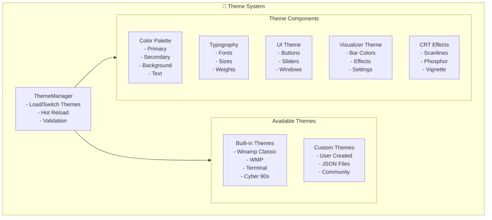

# Theme System Documentation

```
╔══════════════════════════════════════════════════════════════════════════╗
║                           THEME SYSTEM                                    ║
║                    « Every Legend Deserves a New Coat »                     ║
╚══════════════════════════════════════════════════════════════════════════╝
```

## 🎨 Theme Architecture



## 📁 Theme File Format

### JSON Schema

```typescript
// Theme TypeScript Interface
interface Theme {
  // Metadata
  id: string;
  name: string;
  author: string;
  version: string;
  description?: string;
  
  // Color palette
  colors: {
    primary: ColorDefinition;
    secondary: ColorDefinition;
    background: BackgroundColors;
    text: TextColors;
    accent: AccentColors;
    visualizer: VisualizerColors;
  };
  
  // Typography
  typography: {
    fontFamily: string;
    sizes: {
      xs: string;
      sm: string;
      md: string;
      lg: string;
      xl: string;
      '2xl': string;
    };
  };
  
  // UI component styling
  ui: {
    window: WindowTheme;
    button: ButtonTheme;
    slider: SliderTheme;
    playlist: PlaylistTheme;
    equalizer: EqualizerTheme;
  };
  
  // Visualizer specific
  visualizer: {
    spectrum: SpectrumTheme;
    oscilloscope: OscilloscopeTheme;
    milkdrop: MilkdropTheme;
  };
  
  // CRT monitor effects
  crt: CRTEffects;
  
  // Animation settings
  animations: AnimationSettings;
}

interface ColorDefinition {
  main: string;    // Hex color #RRGGBB
  light?: string;
  dark?: string;
}

interface CRTEffects {
  enabled: boolean;
  scanlines: {
    enabled: boolean;
    intensity: number;  // 0.0 - 1.0
    count: number;    // Number of scanlines
    speed: number;    // Animation speed
    blendMode: 'multiply' | 'overlay' | 'normal';
  };
  phosphor: {
    enabled: boolean;
    color: string;      // Hex color
    intensity: number;  // 0.0 - 1.0
    blur: number;       // Pixel blur amount
    persistence: number; // 0.0 - 1.0
  };
  vignette: {
    enabled: boolean;
    intensity: number;  // 0.0 - 1.0
    color: string;
    size: number;       // 0.0 - 1.0
  };
  curvature: {
    enabled: boolean;
    amount: number;     // 0.0 - 0.5
    vignetteStrength: number;
  };
}
```

### Complete Theme Example

```json
{
  "id": "winamp-classic-green",
  "name": "Winamp Classic Green",
  "author": "Winamp Viz Team",
  "version": "1.0.0",
  "description": "The legendary green-on-black Winamp aesthetic",
  
  "colors": {
    "primary": {
      "main": "#00FF00",
      "light": "#66FF66",
      "dark": "#00CC00"
    },
    "secondary": {
      "main": "#00CC00",
      "light": "#99FF99",
      "dark": "#009900"
    },
    "background": {
      "main": "#000000",
      "surface": "#0A0A0A",
      "elevated": "#141414",
      "overlay": "rgba(0, 0, 0, 0.8)"
    },
    "text": {
      "primary": "#00FF00",
      "secondary": "#00CC00",
      "muted": "#006600",
      "disabled": "#003300",
      "inverse": "#000000"
    },
    "accent": {
      "success": "#00FF00",
      "warning": "#FFFF00",
      "error": "#FF0000",
      "info": "#00FFFF"
    },
    "visualizer": {
      "barStart": "#00FF00",
      "barEnd": "#003300",
      "waveform": "#00FF00",
      "peak": "#FFFFFF",
      "background": "#000000"
    }
  },
  
  "typography": {
    "fontFamily": "'Courier New', Courier, monospace",
    "sizes": {
      "xs": "10px",
      "sm": "11px",
      "md": "12px",
      "lg": "14px",
      "xl": "16px",
      "2xl": "20px"
    }
  },
  
  "ui": {
    "window": {
      "borderWidth": 2,
      "borderRadius": 0,
      "shadow": {
        "enabled": true,
        "color": "#003300",
        "blur": 4,
        "spread": 2
      },
      "titleBar": {
        "height": 24,
        "gradient": {
          "start": "#008800",
          "mid": "#00CC00",
          "end": "#008800"
        }
      }
    },
    "button": {
      "borderRadius": 0,
      "borderWidth": 2,
      "shadow": {
        "raised": "inset 1px 1px 0px #66FF66, inset -1px -1px 0px #003300",
        "pressed": "inset 1px 1px 0px #003300, inset -1px -1px 0px #66FF66"
      },
      "padding": {
        "x": 12,
        "y": 4
      }
    },
    "slider": {
      "track": {
        "height": 4,
        "color": "#003300",
        "borderColor": "#006600"
      },
      "thumb": {
        "width": 16,
        "height": 12,
        "color": "#00FF00",
        "borderColor": "#00CC00"
      }
    }
  },
  
  "visualizer": {
    "spectrum": {
      "barCount": 64,
      "useGradient": true,
      "gradient": {
        "type": "linear",
        "stops": [
          { "position": 0, "color": "#003300" },
          { "position": 0.5, "color": "#00CC00" },
          { "position": 1, "color": "#00FF00" }
        ]
      },
      "barSpacing": 1,
      "barWidth": "auto",
      "smoothing": 0.8
    },
    "oscilloscope": {
      "lineColor": "#00FF00",
      "lineWidth": 2,
      "glow": {
        "enabled": true,
        "color": "#00FF00",
        "intensity": 10
      },
      "background": "#000000"
    },
    "milkdrop": {
      "preset": "classic-green",
      "beatReact": true,
      "colorCycle": {
        "enabled": true,
        "speed": 0.5,
        "colors": ["#00FF00", "#00CC00", "#009900"]
      }
    }
  },
  
  "crt": {
    "enabled": true,
    "scanlines": {
      "enabled": true,
      "intensity": 0.3,
      "count": 480,
      "speed": 0,
      "blendMode": "overlay"
    },
    "phosphor": {
      "enabled": true,
      "color": "#00FF00",
      "intensity": 0.5,
      "blur": 2,
      "persistence": 0.3
    },
    "vignette": {
      "enabled": true,
      "intensity": 0.4,
      "color": "#000000",
      "size": 0.7
    },
    "curvature": {
      "enabled": true,
      "amount": 0.05,
      "vignetteStrength": 0.5
    }
  },
  
  "animations": {
    "smoothTransitions": true,
    "transitionDuration": 300,
    "easing": "ease-out",
    "flicker": {
      "enabled": true,
      "intensity": 0.02,
      "speed": 4
    }
  }
}
```

## 🎨 Built-in Themes Showcase

### 1. Winamp Classic Green
```
┌────────────────────────────────────────────────────────┐
│  ██████████████████████████████████████████████████  │
│  ██ WINAMP  █  ▁▂▃▄▅▆▇█                    - □ ✕ ██  │
│  ██                                            ██  │
│  ██  ▓▓▓▓▓▓▓▓▓▓▓▓▓▓▓▓▓▓▓▓▓▓▓▓▓▓▓▓▓▓▓▓▓▓▓▓▓▓  ██  │
│  ██  ▓▓▓▓▓▓▓▓▓▓▓▓▓▓▓▓▓▓▓▓▓▓▓▓▓▓▓▓▓▓▓▓▓▓▓▓▓▓  ██  │
│  ██  ▓▓▓▓▓▓▓▓▓▓▓▓▓▓▓▓▓▓▓▓▓▓▓▓▓▓▓▓▓▓▓▓▓▓▓▓▓▓  ██  │
│  ██  ░░░░░░░░░░░░░░░░░░░░░░░░░░░░░░░░░░░░░░░░  ██  │
│  ██  ░░░░░░░░░░░░░░░░░░░░░░░░░░░░░░░░░░░░░░░░  ██  │
│  ██  ░░░░░░░░░░░░░░░░░░░░░░░░░░░░░░░░░░░░░░░░  ██  │
│  ██  Now Playing: test.mp3 | 192kbps | 44kHz   ██  │
│  ██████████████████████████████████████████████████  │
│                                                      │
│  [⏮] [⏯] [⏹] [⏭]  ▁▂▃▄▅▆▇█  VOL: ████████░░      │
└────────────────────────────────────────────────────────┘
```

### 2. Windows Media Player Classic
```
┌────────────────────────────────────────────────────────┐
│  ░░░░░░░░░░░░░░░░░░░░░░░░░░░░░░░░░░░░░░░░░░░░░░░░░░░░  │
│  ░  Windows Media Player  ░  ▁▂▃▄▅▆       - □ ✕  ░  │
│  ░                                               ░  │
│  ░  ▒▒▒▒▒▒▒▒▒▒▒▒▒▒▒▒▒▒▒▒▒▒▒▒▒▒▒▒▒▒▒▒▒▒▒▒▒▒▒▒  ░  │
│  ░  ▒▒▒▒▒▒▒▒▒▒▒▒▒▒▒▒▒▒▒▒▒▒▒▒▒▒▒▒▒▒▒▒▒▒▒▒▒▒▒▒  ░  │
│  ░  ▒▒▒▒▒▒▒▒▒▒▒▒▒▒▒▒▒▒▒▒▒▒▒▒▒▒▒▒▒▒▒▒▒▒▒▒▒▒▒▒  ░  │
│  ░  ░░░░░░░░░░░░░░░░░░░░░░░░░░░░░░░░░░░░░░░░░░░░  ░  │
│  ░  ░░░░░░░░░░░░░░░░░░░░░░░░░░░░░░░░░░░░░░░░░░░░  ░  │
│  ░  ░░░░░░░░░░░░░░░░░░░░░░░░░░░░░░░░░░░░░░░░░░░░  ░  │
│  ░  Ready...                                    ░  │
│  ░░░░░░░░░░░░░░░░░░░░░░░░░░░░░░░░░░░░░░░░░░░░░░░░░░░░  │
└────────────────────────────────────────────────────────┘
```

### 3. Terminal Green (Matrix Style)
```
┌────────────────────────────────────────────────────────┐
│  ╔══════════════════════════════════════════════════╗  │
│  ║  TERMINAL.EXE                              [_][□][✕] ║  │
│  ║                                                  ║  │
│  ║  ▓▓▓▓▓▓▓▓▓▓▓▓▓▓▓▓▓▓▓▓▓▓▓▓▓▓▓▓▓▓▓▓▓▓▓▓▓▓▓▓▓▓▓▓  ║  │
│  ║  ▓▓▓▓▓▓▓▓▓▓▓▓▓▓▓▓▓▓▓▓▓▓▓▓▓▓▓▓▓▓▓▓▓▓▓▓▓▓▓▓▓▓▓▓  ║  │
│  ║  ▓▓▓▓▓▓▓▓▓▓▓▓▓▓▓▓▓▓▓▓▓▓▓▓▓▓▓▓▓▓▓▓▓▓▓▓▓▓▓▓▓▓▓▓  ║  │
│  ║  ▓▓▓▓▓▓▓▓▓▓▓▓▓▓▓▓▓▓▓▓▓▓▓▓▓▓▓▓▓▓▓▓▓▓▓▓▓▓▓▓▓▓▓▓  ║  │
│  ║  ░░░░░░░░░░░░░░░░░░░░░░░░░░░░░░░░░░░░░░░░░░░░░░░  ║  │
│  ║  ░░░░░░░░░░░░░░░░░░░░░░░░░░░░░░░░░░░░░░░░░░░░░░░  ║  │
│  ║  > playing: track_01.mp3                        ║  │
│  ╚══════════════════════════════════════════════════╝  │
└────────────────────────────────────────────────────────┘
```

### 4. Cyber 90s (Neon)
```
┌────────────────────────────────────────────────────────┐
│  ████████████████████████████████████████████████████  │
│  ██  CYBER.EXE  █ ▓▒░▒▓▒░▒▓▒░▒▓░  - □ ✕  ██  │
│  ██                                               ██  │
│  ██  ▓▒░▒▓▒░▒▓▒░▒▓▒░▒▓▒░▒▓▒░▒▓▒░▒▓▒░▒▓▒░▒▓▒░  ██  │
│  ██  ▒▓░▒▓░▒▓░▒▓░▒▓░▒▓░▒▓░▒▓░▒▓░▒▓░▒▓░▒▓░▒▓  ██  │
│  ██  ▓▒░▒▓▒░▒▓▒░▒▓▒░▒▓▒░▒▓▒░▒▓▒░▒▓▒░▒▓▒░▒▓▒░  ██  │
│  ██  ░▒▓░▒▓░▒▓░▒▓░▒▓░▒▓░▒▓░▒▓░▒▓░▒▓░▒▓░▒▓░▒▓░  ██  │
│  ██  ▓▒░▒▓▒░▒▓▒░▒▓▒░▒▓▒░▒▓▒░▒▓▒░▒▓▒░▒▓▒░▒▓▒░  ██  │
│  ██  ▒▓░▒▓░▒▓░▒▓░▒▓░▒▓░▒▓░▒▓░▒▓░▒▓░▒▓░▒▓░▒▓  ██  │
│  ██  ░▒▓░ NEON SYSTEMS ░▒▓░▒▓░▒▓░▒▓░▒▓░▒▓░▒▓░  ██  │
│  ████████████████████████████████████████████████████  │
└────────────────────────────────────────────────────────┘
```

## 🛠️ Creating Custom Themes

### Step-by-Step Guide

```typescript
// Step 1: Create theme object
const myTheme: Theme = {
  id: 'my-awesome-theme',
  name: 'My Awesome Theme',
  author: 'Your Name',
  version: '1.0.0',
  description: 'A custom theme for the visualizer',
  
  // Step 2: Define colors
  colors: {
    primary: { main: '#FF6B6B', light: '#FF8E8E', dark: '#EE5A5A' },
    // ... rest of theme
  },
  
  // Step 3: Configure components
  ui: {
    window: {
      borderWidth: 3,
      borderRadius: 8,
      // ...
    },
    // ...
  },
  
  // Step 4: Set visualizer options
  visualizer: {
    spectrum: {
      barCount: 128,
      useGradient: true,
      gradient: {
        type: 'linear',
        stops: [
          { position: 0, color: '#FF6B6B' },
          { position: 0.5, color: '#4ECDC4' },
          { position: 1, color: '#45B7D1' },
        ],
      },
    },
    // ...
  },
  
  // Step 5: Configure CRT effects
  crt: {
    enabled: true,
    scanlines: {
      enabled: true,
      intensity: 0.2,
      count: 240,
      speed: 0.5,
    },
    // ...
  },
};

// Step 6: Export as JSON
export default myTheme;
```

### Exporting Your Theme

```bash
# Save as JSON file
echo '{
  "id": "my-theme",
  "name": "My Theme",
  ...
}' > themes/my-theme.json

# Validate theme
npm run theme:validate themes/my-theme.json

# Preview theme
npm run theme:preview themes/my-theme.json

# Package for sharing
npm run theme:package themes/my-theme.json
```

### Theme Validation

```typescript
// src/themes/ThemeValidator.ts

export class ThemeValidator {
  private requiredFields = ['id', 'name', 'author', 'version', 'colors'];
  
  validate(theme: unknown): { valid: boolean; errors: string[] } {
    const errors: string[] = [];
    
    // Check required fields
    for (const field of this.requiredFields) {
      if (!(field in (theme as object))) {
        errors.push(`Missing required field: ${field}`);
      }
    }
    
    // Validate color format
    if (theme.colors) {
      for (const [key, value] of Object.entries(theme.colors)) {
        if (typeof value === 'string' && !this.isValidHex(value)) {
          errors.push(`Invalid color format for ${key}: ${value}`);
        }
      }
    }
    
    // Validate ranges
    if (theme.crt?.scanlines?.intensity !== undefined) {
      if (theme.crt.scanlines.intensity < 0 || theme.crt.scanlines.intensity > 1) {
        errors.push('Scanline intensity must be between 0 and 1');
      }
    }
    
    return {
      valid: errors.length === 0,
      errors,
    };
  }
  
  private isValidHex(color: string): boolean {
    return /^#[0-9A-Fa-f]{6}$/.test(color);
  }
}
```

## 🔄 Dynamic Theme Switching

```typescript
// src/themes/ThemeManager.ts

export class ThemeManager {
  private currentTheme: Theme;
  private themes = new Map<string, Theme>();
  private subscribers: ((theme: Theme) => void)[] = [];
  
  constructor(defaultTheme: Theme) {
    this.currentTheme = defaultTheme;
    this.register(defaultTheme);
  }
  
  register(theme: Theme): void {
    // Validate before registering
    const validation = this.validateTheme(theme);
    if (!validation.valid) {
      throw new Error(`Invalid theme: ${validation.errors.join(', ')}`);
    }
    
    this.themes.set(theme.id, theme);
  }
  
  async switchTheme(themeId: string): Promise<void> {
    const theme = this.themes.get(themeId);
    if (!theme) {
      throw new Error(`Theme not found: ${themeId}`);
    }
    
    // Apply transition
    await this.transitionTo(theme);
    
    this.currentTheme = theme;
    this.notifySubscribers();
  }
  
  private async transitionTo(theme: Theme): Promise<void> {
    // Animate color transitions
    const duration = theme.animations?.transitionDuration ?? 300;
    
    // Update CSS variables
    this.updateCSSVariables(theme);
    
    // Update Three.js materials
    this.updateMaterials(theme);
    
    // Update CRT shader uniforms
    this.updateCRTEffects(theme);
    
    await this.wait(duration);
  }
  
  private updateCSSVariables(theme: Theme): void {
    const root = document.documentElement;
    
    // Colors
    root.style.setProperty('--color-primary', theme.colors.primary.main);
    root.style.setProperty('--color-bg', theme.colors.background.main);
    // ... more variables
  }
  
  private updateMaterials(theme: Theme): void {
    // Update all Three.js materials with new theme colors
    // This would be called from the visualizer components
  }
  
  subscribe(callback: (theme: Theme) => void): () => void {
    this.subscribers.push(callback);
    
    return () => {
      const index = this.subscribers.indexOf(callback);
      if (index > -1) {
        this.subscribers.splice(index, 1);
      }
    };
  }
  
  private notifySubscribers(): void {
    this.subscribers.forEach(cb => cb(this.currentTheme));
  }
  
  private wait(ms: number): Promise<void> {
    return new Promise(resolve => setTimeout(resolve, ms));
  }
}
```

## 📤 Sharing Themes

### Theme Marketplace Format

```json
{
  "theme": {
    "id": "sunset-vibes",
    "name": "Sunset Vibes",
    "author": "CoolDesigner99",
    "version": "2.1.0",
    "description": "Warm orange and purple gradients inspired by sunsets",
    "tags": ["warm", "gradient", "sunset"],
    "preview": "https://example.com/previews/sunset-vibes.png",
    "download": "https://example.com/themes/sunset-vibes.json",
    "license": "MIT"
  },
  "stats": {
    "downloads": 15420,
    "rating": 4.8,
    "reviews": 342
  },
  "compatibility": {
    "minVersion": "1.0.0",
    "maxVersion": "2.x"
  }
}
```

### Loading External Themes

```typescript
async function loadExternalTheme(url: string): Promise<Theme> {
  // Security: Only allow themes from trusted sources
  if (!isTrustedDomain(url)) {
    throw new Error('Theme source not trusted');
  }
  
  const response = await fetch(url);
  if (!response.ok) {
    throw new Error(`Failed to load theme: ${response.status}`);
  }
  
  const themeData = await response.json();
  
  // Validate before applying
  const validator = new ThemeValidator();
  const result = validator.validate(themeData);
  
  if (!result.valid) {
    throw new Error(`Invalid theme: ${result.errors.join(', ')}`);
  }
  
  return themeData as Theme;
}
```

---

```
╔══════════════════════════════════════════════════════════════════╗
║                                                                  ║
║  "Design is not just what it looks like and feels like.          ║
║   Design is how it works."                                        ║
║                                    - Steve Jobs                  ║
╚══════════════════════════════════════════════════════════════════╝
```
