# UI/UX Design System

```
╔══════════════════════════════════════════════════════════════════════════╗
║                       UI/UX DESIGN SPECIFICATION                          ║
║                    « The 90s Aesthetic Never Dies »                       ║
╚══════════════════════════════════════════════════════════════════════════╝
```

## 🎨 90s Aesthetic Overview

```mermaid
flowchart TB
    subgraph Aesthetic["🎨 90s Design Elements"]
        Colors["Color Palettes\n- Winamp Green\n- WMP Blue\n- Matrix Green\n- Cyber Neon"]
        
        Typography["Typography\n- Bitmap Fonts\n- Pixel Perfect\n- Courier New\n- MS Sans Serif"]
        
        Effects["Visual Effects\n- CRT Scanlines\n- Phosphor Glow\n- Vignette\n- Screen Curvature"]
        
        Components["UI Components\n- 3D Buttons\n- Skeuomorphic\n- Chunky Borders\n- XP-style Shadows"]
    end
    
    subgraph Nostalgia["💾 Nostalgic Details"]
        Menus["Context Menus\n- Right-click\n- Checkboxes\n- Separators"]
        
        Status["Status Bars\n- Playing time\n- File info\n- KBPS display"]
        
        Easter["Easter Eggs\n- Secret shortcuts\n- Classic references\n- ASCII art"]
    end
    
    Aesthetic --> Nostalgia
```



## 🎨 Color Palettes

### Winamp Classic (Default)

```css
:root {
  /* Primary Colors - That iconic green */
  --winamp-green: #00FF00;
  --winamp-green-dim: #00CC00;
  --winamp-green-dark: #009900;
  --winamp-green-bright: #66FF66;
  
  /* Background - Black with subtle depth */
  --bg-primary: #000000;
  --bg-secondary: #0a0a0a;
  --bg-elevated: #141414;
  
  /* UI Elements */
  --text-primary: #00FF00;
  --text-secondary: #00CC00;
  --text-muted: #006600;
  --border-color: #00FF00;
  --border-dim: #003300;
  
  /* Accent States */
  --active: #00FF00;
  --inactive: #003300;
  --hover: #66FF66;
  --disabled: #001100;
  
  /* Special Effects */
  --glow-color: rgba(0, 255, 0, 0.5);
  --scanline-color: rgba(0, 255, 0, 0.1);
}
```

### Windows Media Player Classic

```css
:root {
  /* Classic WMP Blue */
  --wmp-blue: #0066CC;
  --wmp-blue-light: #3399FF;
  --wmp-blue-dark: #003399;
  
  /* Metallic gradients */
  --metallic-top: #E8E8E8;
  --metallic-mid: #C0C0C0;
  --metallic-bottom: #808080;
  
  /* Background */
  --bg-gradient-start: #000033;
  --bg-gradient-end: #000066;
  
  /* Text */
  --text-primary: #FFFFFF;
  --text-secondary: #99CCFF;
}
```

### Terminal / Matrix

```css
:root {
  /* Matrix Green */
  --matrix-green: #00FF41;
  --matrix-green-dim: #008F11;
  --matrix-green-dark: #003B00;
  --matrix-green-bright: #99FF99;
  
  /* Dark terminal */
  --terminal-bg: #0C0C0C;
  --terminal-grid: rgba(0, 255, 65, 0.03);
  
  /* Phosphor glow */
  --phosphor-color: #00FF41;
  --phosphor-blur: 8px;
}
```

### Cyber 90s (Neon)

```css
:root {
  /* Hot Pink */
  --neon-pink: #FF00FF;
  --neon-pink-light: #FF69B4;
  --neon-pink-dark: #C71585;
  
  /* Cyan */
  --neon-cyan: #00FFFF;
  --neon-cyan-light: #E0FFFF;
  --neon-cyan-dark: #00CED1;
  
  /* Purple */
  --neon-purple: #9400D3;
  
  /* Dark backgrounds */
  --cyber-bg: #0a0a0f;
  --cyber-grid: rgba(255, 0, 255, 0.1);
}
```

## 🔤 Typography System

### Font Stack

```css
/* Primary - Bitmap/Monospace */
--font-primary: 'Courier New', 'Courier', monospace;

/* Alternative - System Monospace */
--font-mono: 'Consolas', 'Monaco', 'Lucida Console', monospace;

/* Fallback - Sans Serif */
--font-sans: 'MS Sans Serif', 'Tahoma', sans-serif;

/* Winamp-style - Bold headers */
--font-header: 'Arial Black', 'Helvetica Bold', sans-serif;
```

### Type Scale

```css
/* 90s-style pixel-perfect sizing */
--text-xs: 10px;    /* Status info */
--text-sm: 11px;    /* Labels */
--text-md: 12px;    /* Body text */
--text-lg: 14px;    /* Section headers */
--text-xl: 16px;    /* Titles */
--text-2xl: 20px;   /* Main title */

/* Line heights - tight for 90s look */
--leading-none: 1;
--leading-tight: 1.2;
--leading-normal: 1.4;
```

### Bitmap Font Implementation

```typescript
// src/ui/utils/BitmapFontLoader.ts

export interface BitmapFont {
  charWidth: number;
  charHeight: number;
  texture: THREE.Texture;
  charMap: Map<string, [number, number]>;
}

export async function loadBitmapFont(
  texturePath: string,
  charMapPath: string
): Promise<BitmapFont> {
  const [texture, charMapData] = await Promise.all([
    loadTexture(texturePath),
    fetch(charMapPath).then(r => r.json()),
  ]);

  const charMap = new Map<string, [number, number]>();
  for (const [char, coords] of Object.entries(charMapData)) {
    charMap.set(char, coords as [number, number]);
  }

  return {
    charWidth: charMapData.width,
    charHeight: charMapData.height,
    texture,
    charMap,
  };
}

// Usage for retro text rendering
export function createBitmapText(
  text: string,
  font: BitmapFont,
  material: THREE.Material
): THREE.Mesh {
  const geometry = new THREE.PlaneGeometry(
    font.charWidth * text.length,
    font.charHeight
  );
  
  // UV mapping for each character
  const uvs: number[] = [];
  for (const char of text) {
    const coords = font.charMap.get(char) || [0, 0];
    const u = coords[0] * font.charWidth;
    const v = coords[1] * font.charHeight;
    uvs.push(u, v);
  }
  
  geometry.setAttribute('uv', new THREE.Float32BufferAttribute(uvs, 2));
  
  return new THREE.Mesh(geometry, material);
}
```

## 📺 CRT Monitor Effects

### Scanlines Shader

```glsl
// src/rendering/shaders/scanlines.frag

uniform sampler2D tDiffuse;
uniform float time;
uniform float intensity;
uniform float lineCount;
uniform vec3 lineColor;

varying vec2 vUv;

void main() {
  vec4 color = texture2D(tDiffuse, vUv);
  
  // Calculate scanline position
  float scanline = sin(vUv.y * lineCount * 3.14159);
  
  // Darken every other line
  float scanlineIntensity = (scanline + 1.0) * 0.5 * intensity;
  
  // Add subtle moving interference
  float interference = sin(vUv.y * 200.0 + time * 10.0) * 0.02;
  
  // Apply scanline effect
  vec3 scanlineColor = mix(color.rgb, lineColor, scanlineIntensity * 0.3);
  scanlineColor *= (1.0 - intensity + scanlineIntensity);
  
  // Add slight chromatic aberration
  float aberration = 0.002;
  float r = texture2D(tDiffuse, vUv + vec2(aberration, 0.0)).r;
  float b = texture2D(tDiffuse, vUv - vec2(aberration, 0.0)).b;
  
  gl_FragColor = vec4(r, scanlineColor.g, b, color.a);
}
```

### Phosphor Glow Effect

```glsl
// src/rendering/shaders/phosphor.frag

uniform sampler2D tDiffuse;
uniform vec3 phosphorColor;
uniform float glowIntensity;
uniform float decay;

varying vec2 vUv;

void main() {
  vec4 color = texture2D(tDiffuse, vUv);
  
  // Calculate luminance
  float luminance = dot(color.rgb, vec3(0.299, 0.587, 0.114));
  
  // Phosphor glow based on brightness
  vec3 glow = phosphorColor * luminance * glowIntensity;
  
  // Add bloom for bright areas
  float bloom = smoothstep(0.5, 1.0, luminance) * glowIntensity;
  
  // Combine original with glow
  vec3 finalColor = color.rgb + glow + (phosphorColor * bloom);
  
  // Apply slight decay (phosphor persistence)
  finalColor *= decay;
  
  gl_FragColor = vec4(finalColor, color.a);
}
```

### Screen Curvature

```glsl
// src/rendering/shaders/curvature.frag

uniform sampler2D tDiffuse;
uniform float curvature;

varying vec2 vUv;

vec2 curveUV(vec2 uv) {
  // Apply barrel distortion
  vec2 centered = uv - 0.5;
  float dist = length(centered);
  float distortion = 1.0 + curvature * dist * dist;
  
  return centered * distortion + 0.5;
}

void main() {
  vec2 curvedUV = curveUV(vUv);
  
  // Check if UV is outside valid range (creates vignette)
  if (curvedUV.x < 0.0 || curvedUV.x > 1.0 || 
      curvedUV.y < 0.0 || curvedUV.y > 1.0) {
    gl_FragColor = vec4(0.0, 0.0, 0.0, 1.0);
    return;
  }
  
  vec4 color = texture2D(tDiffuse, curvedUV);
  
  // Vignette effect
  float vignette = 1.0 - length(vUv - 0.5) * 0.5;
  color.rgb *= vignette;
  
  gl_FragColor = color;
}
```

### CSS CRT Effect (Fallback)

```css
/* For non-WebGL fallback or UI elements */
.crt-effect {
  position: relative;
}

.crt-effect::before {
  content: '';
  position: absolute;
  top: 0;
  left: 0;
  right: 0;
  bottom: 0;
  background: repeating-linear-gradient(
    0deg,
    rgba(0, 0, 0, 0.15),
    rgba(0, 0, 0, 0.15) 1px,
    transparent 1px,
    transparent 2px
  );
  pointer-events: none;
  z-index: 10;
}

.crt-effect::after {
  content: '';
  position: absolute;
  top: 0;
  left: 0;
  right: 0;
  bottom: 0;
  background: radial-gradient(
    ellipse at center,
    transparent 0%,
    rgba(0, 0, 0, 0.4) 90%,
    rgba(0, 0, 0, 0.6) 100%
  );
  pointer-events: none;
  z-index: 11;
}

/* Phosphor glow text */
.phosphor-glow {
  text-shadow: 
    0 0 5px var(--phosphor-color),
    0 0 10px var(--phosphor-color),
    0 0 20px var(--phosphor-color);
}

/* Flicker animation */
@keyframes flicker {
  0%, 100% { opacity: 1; }
  50% { opacity: 0.95; }
  52% { opacity: 1; }
  55% { opacity: 0.97; }
}

.crt-flicker {
  animation: flicker 4s infinite;
}
```

## 🎛️ UI Components

### Main Window

```typescript
// src/ui/components/MainWindow.ts

import * as THREE from 'three';

export interface MainWindowConfig {
  width: number;
  height: number;
  title: string;
  resizable: boolean;
}

export class MainWindow {
  private mesh: THREE.Group;
  private titleBar: THREE.Mesh;
  private contentArea: THREE.Mesh;
  private borderMesh: THREE.Mesh;

  constructor(config: MainWindowConfig) {
    this.mesh = new THREE.Group();
    this.createBorder(config);
    this.createTitleBar(config);
    this.createContentArea(config);
  }

  private createBorder(config: MainWindowConfig): void {
    // 90s-style chunky border
    const geometry = new THREE.BoxGeometry(
      config.width + 8,
      config.height + 8,
      2
    );
    
    // 3D bevel effect using materials
    const materials = [
      new THREE.MeshBasicMaterial({ color: 0x404040 }), // Right
      new THREE.MeshBasicMaterial({ color: 0x808080 }), // Left
      new THREE.MeshBasicMaterial({ color: 0xffffff }), // Top (light)
      new THREE.MeshBasicMaterial({ color: 0x202020 }), // Bottom (shadow)
      new THREE.MeshBasicMaterial({ color: 0x00ff00 }), // Front (Winamp green)
      new THREE.MeshBasicMaterial({ color: 0x008800 }), // Back
    ];

    this.borderMesh = new THREE.Mesh(geometry, materials);
    this.mesh.add(this.borderMesh);
  }

  private createTitleBar(config: MainWindowConfig): void {
    // Gradient title bar
    const canvas = document.createElement('canvas');
    canvas.width = config.width;
    canvas.height = 24;
    const ctx = canvas.getContext('2d')!;
    
    // 90s gradient
    const gradient = ctx.createLinearGradient(0, 0, 0, 24);
    gradient.addColorStop(0, '#008800');
    gradient.addColorStop(0.5, '#00cc00');
    gradient.addColorStop(1, '#008800');
    
    ctx.fillStyle = gradient;
    ctx.fillRect(0, 0, config.width, 24);
    
    // Add title text
    ctx.fillStyle = '#000000';
    ctx.font = 'bold 12px Arial';
    ctx.fillText(config.title, 8, 16);
    
    const texture = new THREE.CanvasTexture(canvas);
    const geometry = new THREE.PlaneGeometry(config.width, 24);
    const material = new THREE.MeshBasicMaterial({ 
      map: texture,
      transparent: true 
    });
    
    this.titleBar = new THREE.Mesh(geometry, material);
    this.titleBar.position.y = config.height / 2 - 12;
    this.mesh.add(this.titleBar);
  }

  private createContentArea(config: MainWindowConfig): void {
    const geometry = new THREE.PlaneGeometry(
      config.width,
      config.height - 24
    );
    const material = new THREE.MeshBasicMaterial({ 
      color: 0x000000,
      transparent: true,
      opacity: 0.95
    });
    
    this.contentArea = new THREE.Mesh(geometry, material);
    this.contentArea.position.y = -12;
    this.mesh.add(this.contentArea);
  }
}
```

### 3D Buttons

```typescript
// src/ui/components/Button3D.ts

export interface Button3DConfig {
  text: string;
  width: number;
  height: number;
  onClick: () => void;
}

export class Button3D {
  private group: THREE.Group;
  private isPressed = false;

  constructor(config: Button3DConfig) {
    this.group = new THREE.Group();
    this.createButton(config);
    this.setupInteraction(config.onClick);
  }

  private createButton(config: Button3DConfig): void {
    // Button background with 3D effect
    const geometry = new THREE.BoxGeometry(config.width, config.height, 4);
    
    // 90s-style raised button
    const raisedMaterials = [
      new THREE.MeshBasicMaterial({ color: 0x404040 }), // Sides
      new THREE.MeshBasicMaterial({ color: 0x404040 }),
      new THREE.MeshBasicMaterial({ color: 0x00ff00 }), // Top bright
      new THREE.MeshBasicMaterial({ color: 0x006600 }), // Bottom shadow
      new THREE.MeshBasicMaterial({ color: 0x00cc00 }), // Front
      new THREE.MeshBasicMaterial({ color: 0x008800 }),
    ];
    
    const buttonMesh = new THREE.Mesh(geometry, raisedMaterials);
    this.group.add(buttonMesh);

    // Button text
    const label = this.createText(config.text);
    label.position.z = 2.1;
    this.group.add(label);
  }

  private setupInteraction(onClick: () => void): void {
    // Raycaster-based interaction
    const raycaster = new THREE.Raycaster();
    const mouse = new THREE.Vector2();

    window.addEventListener('mousedown', (event) => {
      mouse.x = (event.clientX / window.innerWidth) * 2 - 1;
      mouse.y = -(event.clientY / window.innerHeight) * 2 + 1;
      
      raycaster.setFromCamera(mouse, camera);
      const intersects = raycaster.intersectObjects(this.group.children);
      
      if (intersects.length > 0) {
        this.press();
      }
    });

    window.addEventListener('mouseup', () => {
      if (this.isPressed) {
        this.release();
        onClick();
      }
    });
  }

  press(): void {
    this.isPressed = true;
    this.group.position.z = -2; // Press in
    // Change to pressed materials (inverted shadows)
  }

  release(): void {
    this.isPressed = false;
    this.group.position.z = 0; // Release
  }
}
```

### Sliders (Volume, Seek)

```typescript
// src/ui/components/Slider.ts

export interface SliderConfig {
  min: number;
  max: number;
  value: number;
  width: number;
  orientation: 'horizontal' | 'vertical';
  onChange: (value: number) => void;
}

export class Slider {
  private track: THREE.Mesh;
  private thumb: THREE.Mesh;
  private value: number;

  constructor(config: SliderConfig) {
    this.value = config.value;
    this.createTrack(config);
    this.createThumb(config);
    this.setupInteraction(config);
  }

  private createTrack(config: SliderConfig): void {
    const geometry = new THREE.BoxGeometry(
      config.orientation === 'horizontal' ? config.width : 8,
      config.orientation === 'horizontal' ? 8 : config.width,
      2
    );
    
    const material = new THREE.MeshBasicMaterial({
      color: 0x202020,
    });
    
    // Add border
    const canvas = document.createElement('canvas');
    const texture = new THREE.CanvasTexture(canvas);
    
    this.track = new THREE.Mesh(geometry, [
      material, material, material, material,
      new THREE.MeshBasicMaterial({ map: texture }),
      material,
    ]);
  }

  private createThumb(config: SliderConfig): void {
    // 3D thumb handle
    const geometry = new THREE.BoxGeometry(
      config.orientation === 'horizontal' ? 16 : 12,
      config.orientation === 'horizontal' ? 12 : 16,
      6
    );
    
    const material = new THREE.MeshBasicMaterial({
      color: 0x00ff00,
    });
    
    this.thumb = new THREE.Mesh(geometry, material);
    this.updateThumbPosition(config);
  }

  private setupInteraction(config: SliderConfig): void {
    // Drag logic with raycasting
    // Update thumb position and emit value changes
  }
}
```

## 📜 Nostalgic Details

### Status Bar

```typescript
// src/ui/components/StatusBar.ts

export class StatusBar {
  private display: THREE.Mesh;
  
  updateInfo(info: {
    trackName?: string;
    bitrate?: number;
    sampleRate?: number;
    channels?: number;
    position?: string;
    duration?: string;
  }): void {
    // Format: "Artist - Title | 192kbps | 44kHz | Stereo | 1:23/4:56"
    const text = this.formatStatus(info);
    this.updateDisplay(text);
  }

  private formatStatus(info: StatusInfo): string {
    const parts: string[] = [];
    
    if (info.trackName) {
      parts.push(this.truncate(info.trackName, 30));
    }
    
    if (info.bitrate) {
      parts.push(`${info.bitrate}kbps`);
    }
    
    if (info.sampleRate) {
      parts.push(`${info.sampleRate / 1000}kHz`);
    }
    
    if (info.channels) {
      parts.push(info.channels === 2 ? 'Stereo' : 'Mono');
    }
    
    if (info.position && info.duration) {
      parts.push(`${info.position}/${info.duration}`);
    }
    
    return parts.join(' | ');
  }

  private truncate(str: string, length: number): string {
    return str.length > length ? str.slice(0, length - 3) + '...' : str;
  }
}
```

### Context Menus

```css
/* Classic Winamp-style context menu */
.context-menu {
  background: #c0c0c0;
  border: 2px outset #ffffff;
  box-shadow: 2px 2px 4px rgba(0, 0, 0, 0.5);
  font-family: 'MS Sans Serif', Tahoma, sans-serif;
  font-size: 11px;
  padding: 2px;
  min-width: 120px;
}

.context-menu-item {
  padding: 4px 20px;
  cursor: pointer;
}

.context-menu-item:hover {
  background: #000080;
  color: white;
}

.context-menu-separator {
  border-top: 1px solid #808080;
  border-bottom: 1px solid #ffffff;
  margin: 2px 0;
}

.context-menu-checkmark::before {
  content: '✓';
  position: absolute;
  left: 4px;
}
```

### Easter Eggs

```typescript
// src/ui/easter-eggs.ts

export const EASTER_EGGS = {
  // Konami code
  KONAMI: {
    sequence: ['ArrowUp', 'ArrowUp', 'ArrowDown', 'ArrowDown', 
               'ArrowLeft', 'ArrowRight', 'ArrowLeft', 'ArrowRight', 
               'b', 'a'],
    action: () => {
      console.log('🥚 Classic mode activated!');
      // Enable hidden classic Winamp skin
    },
  },
  
  // Secret click on logo
  LOGO_CLICK: {
    clicks: 5,
    action: () => {
      console.log('🦙 It really whips the llama\'s ass!');
      // Show llama animation
    },
  },
  
  // Type "WINAMP" while playing
  WINAMP_TYPING: {
    sequence: ['w', 'i', 'n', 'a', 'm', 'p'],
    action: () => {
      // Toggle ultra-secret vaporwave theme
      console.log('✨ Vaporwave mode activated');
    },
  },
};

export class EasterEggManager {
  private keyBuffer: string[] = [];
  private clickCount = 0;
  private lastClickTime = 0;

  handleKeyPress(key: string): void {
    this.keyBuffer.push(key);
    
    // Keep only last 10 keys
    if (this.keyBuffer.length > 10) {
      this.keyBuffer.shift();
    }
    
    // Check sequences
    this.checkSequences();
  }

  handleLogoClick(): void {
    const now = Date.now();
    
    // Reset if too much time passed
    if (now - this.lastClickTime > 1000) {
      this.clickCount = 0;
    }
    
    this.clickCount++;
    this.lastClickTime = now;
    
    if (this.clickCount >= EASTER_EGGS.LOGO_CLICK.clicks) {
      EASTER_EGGS.LOGO_CLICK.action();
      this.clickCount = 0;
    }
  }

  private checkSequences(): void {
    const current = this.keyBuffer.join(',');
    
    if (current.includes(EASTER_EGGS.WINAMP_TYPING.sequence.join(','))) {
      EASTER_EGGS.WINAMP_TYPING.action();
      this.keyBuffer = [];
    }
  }
}
```

## 🎭 Animation Patterns

### 90s-Style Animations

```css
/* Pulse glow for active elements */
@keyframes pulse-glow {
  0%, 100% {
    box-shadow: 0 0 5px var(--winamp-green);
  }
  50% {
    box-shadow: 0 0 20px var(--winamp-green), 0 0 40px var(--winamp-green);
  }
}

/* Equalizer bar bounce */
@keyframes eq-bounce {
  0%, 100% { transform: scaleY(1); }
  50% { transform: scaleY(1.2); }
}

/* Window open (maximize) */
@keyframes window-open {
  from {
    transform: scale(0);
    opacity: 0;
  }
  to {
    transform: scale(1);
    opacity: 1;
  }
}

/* Marquee text scroll */
@keyframes marquee {
  from { transform: translateX(100%); }
  to { transform: translateX(-100%); }
}
```

## 📱 Responsive Considerations

```typescript
// src/ui/utils/ResponsiveLayout.ts

export class ResponsiveLayout {
  private breakpoints = {
    mobile: 480,
    tablet: 768,
    desktop: 1024,
    large: 1440,
  };

  getLayoutSize(): 'mobile' | 'tablet' | 'desktop' | 'large' {
    const width = window.innerWidth;
    
    if (width < this.breakpoints.mobile) return 'mobile';
    if (width < this.breakpoints.tablet) return 'tablet';
    if (width < this.breakpoints.desktop) return 'desktop';
    return 'large';
  }

  getVisualizerDimensions(): { width: number; height: number } {
    const size = this.getLayoutSize();
    
    const dimensions = {
      mobile: { width: 300, height: 150 },
      tablet: { width: 500, height: 250 },
      desktop: { width: 700, height: 350 },
      large: { width: 900, height: 450 },
    };
    
    return dimensions[size];
  }
}
```

---

```
╔══════════════════════════════════════════════════════════════════╗
║                                                                  ║
║  "Good design is making something intelligible and memorable.    ║
║   Great design is making something memorable and meaningful."      ║
║                                      - Dieter Rams               ║
╚══════════════════════════════════════════════════════════════════╝
```
