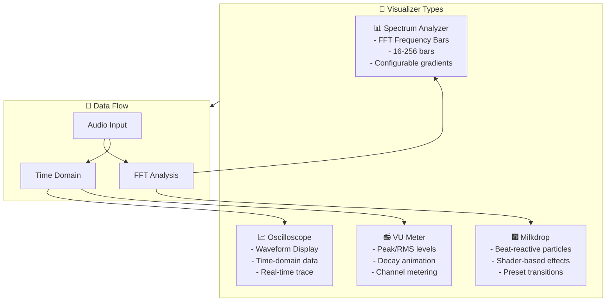

# Visualizer Documentation

```
╔══════════════════════════════════════════════════════════════════════════╗
║                           VISUALIZER DOCUMENTATION                        ║
║                    « See the Music, Feel the Beat »                       ║
╚══════════════════════════════════════════════════════════════════════════╝
```

## 🎵 Visualizer Overview



## 📊 Spectrum Analyzer

### Overview
The Spectrum Analyzer visualizes frequency data using FFT (Fast Fourier Transform) analysis, displaying audio frequencies as animated bars.

### Algorithm

```typescript
// src/visualizers/SpectrumAnalyzer.ts

export class SpectrumAnalyzer extends BaseVisualizer {
  private bars: BarGeometry[] = [];
  private barCount: number;
  private fftSize: number;
  private smoothing: number;
  private previousValues: Float32Array;

  constructor(config: SpectrumConfig) {
    super();
    this.barCount = config.barCount ?? 64;
    this.fftSize = config.fftSize ?? 2048;
    this.smoothing = config.smoothing ?? 0.8;
    this.previousValues = new Float32Array(this.barCount);
  }

  /**
   * Update bar heights based on frequency data
   * 
   * Algorithm:
   * 1. Divide frequency data into logarithmic bands
   * 2. Calculate average amplitude for each band
   * 3. Apply smoothing to prevent jitter
   * 4. Update bar geometry
   */
  update(audioData: AudioData): void {
    const frequencyData = audioData.frequencyData;
    const bands = this.calculateLogarithmicBands(frequencyData);
    
    for (let i = 0; i < this.barCount; i++) {
      // Get raw value (0-255)
      const rawValue = bands[i];
      
      // Apply exponential scaling for better visual representation
      // Lower frequencies appear stronger than they are
      const scaledValue = Math.pow(rawValue / 255, 1.5) * 255;
      
      // Apply smoothing (low-pass filter)
      const smoothedValue = 
        this.previousValues[i] * this.smoothing + 
        scaledValue * (1 - this.smoothing);
      
      this.previousValues[i] = smoothedValue;
      
      // Update bar height (normalized 0-1)
      this.bars[i].targetHeight = smoothedValue / 255;
    }
  }

  /**
   * Divide frequency data into logarithmic bands
   * 
   * Lower frequencies get more bars (more musically relevant)
   * Higher frequencies get fewer bars (less detailed)
   */
  private calculateLogarithmicBands(data: Uint8Array): number[] {
    const bands: number[] = [];
    const nyquist = audioData.sampleRate / 2;
    
    for (let i = 0; i < this.barCount; i++) {
      // Logarithmic frequency distribution
      const startFreq = this.getLogFrequency(i, this.barCount, nyquist);
      const endFreq = this.getLogFrequency(i + 1, this.barCount, nyquist);
      
      // Convert to FFT bin indices
      const startBin = Math.floor(startFreq / nyquist * data.length);
      const endBin = Math.floor(endFreq / nyquist * data.length);
      
      // Calculate average for this band
      let sum = 0;
      let count = 0;
      for (let j = startBin; j < endBin && j < data.length; j++) {
        sum += data[j];
        count++;
      }
      
      bands.push(count > 0 ? sum / count : 0);
    }
    
    return bands;
  }

  private getLogFrequency(index: number, total: number, nyquist: number): number {
    const minFreq = 20;  // Human hearing lower limit
    const maxFreq = nyquist;
    
    const logMin = Math.log2(minFreq);
    const logMax = Math.log2(maxFreq);
    const logRange = logMax - logMin;
    
    return Math.pow(2, logMin + (index / total) * logRange);
  }

  render(deltaTime: number): void {
    // Interpolate bar heights for smooth animation
    const lerpFactor = 1 - Math.exp(-deltaTime * 10);
    
    for (let i = 0; i < this.barCount; i++) {
      const bar = this.bars[i];
      
      // Smooth interpolation between current and target
      bar.currentHeight += (bar.targetHeight - bar.currentHeight) * lerpFactor;
      
      // Update Three.js mesh
      bar.mesh.scale.y = bar.currentHeight;
      bar.mesh.position.y = bar.currentHeight / 2;
      
      // Update color based on height (gradient effect)
      const color = this.getGradientColor(bar.currentHeight);
      (bar.mesh.material as THREE.MeshBasicMaterial).color.set(color);
    }
  }

  private getGradientColor(height: number): THREE.Color {
    // Map height (0-1) to gradient colors
    if (!this.gradient) return new THREE.Color(0x00ff00);
    
    const index = Math.floor(height * (this.gradient.length - 1));
    return this.gradient[Math.min(index, this.gradient.length - 1)];
  }
}
```

### Configuration Options

```typescript
interface SpectrumConfig {
  /** Number of bars (16-256) */
  barCount?: number;
  
  /** FFT size (128-32768, power of 2) */
  fftSize?: number;
  
  /** Smoothing factor (0.0-1.0) */
  smoothing?: number;
  
  /** Use gradient colors */
  useGradient?: boolean;
  
  /** Gradient color stops */
  gradient?: ColorStop[];
  
  /** Bar spacing in pixels */
  barSpacing?: number;
  
  /** Bar width ('auto' or fixed pixels) */
  barWidth?: 'auto' | number;
  
  /** Enable reflection effect */
  reflection?: boolean;
  
  /** Minimum bar height (to show empty bars) */
  minHeight?: number;
}
```

### Visual Examples

```
Low Frequencies (Bass)        Mid Frequencies         High Frequencies (Treble)
    ▓▓▓▓▓▓▓▓                      ▓▓▓▓                    ▓▓
    ▓▓▓▓▓▓▓▓▓▓▓                  ▓▓▓▓▓▓▓▓                ▓▓▓▓
    ▓▓▓▓▓▓▓▓▓▓▓▓▓▓              ▓▓▓▓▓▓▓▓▓▓▓▓            ▓▓▓▓▓▓
    ▓▓▓▓▓▓▓▓▓▓▓▓▓▓▓▓            ▓▓▓▓▓▓▓▓▓▓▓▓▓▓          ▓▓▓▓▓▓▓▓
    ░░░░░░░░░░░░░░░░            ░░░░░░░░░░░░░░            ░░░░░░░░
    ░░░░░░░░░░░░░░░░░░          ░░░░░░░░░░░░░░░░          ░░░░░░░░░░
```

## 📈 Oscilloscope

### Overview
The Oscilloscope displays the raw audio waveform in real-time, showing amplitude over time.

### Algorithm

```typescript
// src/visualizers/Oscilloscope.ts

export class Oscilloscope extends BaseVisualizer {
  private points: THREE.Vector3[] = [];
  private line: THREE.Line;
  private timeWindow: number;  // Milliseconds to display
  private samples: Float32Array;
  
  constructor(config: OscilloscopeConfig) {
    super();
    this.timeWindow = config.timeWindow ?? 100; // 100ms default
    this.samples = new Float32Array(0);
  }

  /**
   * Update waveform from time-domain data
   * 
   * Algorithm:
   * 1. Capture time-domain samples
   * 2. Calculate how many samples fit in timeWindow
   * 3. Create 3D points from amplitude values
   * 4. Apply smoothing to reduce noise
   */
  update(audioData: AudioData): void {
    const timeDomain = audioData.timeDomainData;
    const sampleRate = audioData.sampleRate;
    
    // Calculate samples needed for timeWindow
    const samplesNeeded = Math.floor(
      (this.timeWindow / 1000) * sampleRate
    );
    
    // Downsample or interpolate to fit display
    this.samples = this.resample(timeDomain, samplesNeeded);
    
    // Apply smoothing filter to reduce noise
    this.samples = this.applySmoothing(this.samples);
  }

  private resample(data: Uint8Array, targetLength: number): Float32Array {
    const result = new Float32Array(targetLength);
    const step = data.length / targetLength;
    
    for (let i = 0; i < targetLength; i++) {
      const idx = Math.floor(i * step);
      // Convert from Uint8 (0-255) to float (-1 to 1)
      result[i] = (data[idx] - 128) / 128;
    }
    
    return result;
  }

  private applySmoothing(data: Float32Array): Float32Array {
    // Simple moving average smoothing
    const smoothed = new Float32Array(data.length);
    const windowSize = 3;
    
    for (let i = 0; i < data.length; i++) {
      let sum = 0;
      let count = 0;
      
      for (let j = -windowSize; j <= windowSize; j++) {
        const idx = i + j;
        if (idx >= 0 && idx < data.length) {
          sum += data[idx];
          count++;
        }
      }
      
      smoothed[i] = sum / count;
    }
    
    return smoothed;
  }

  render(deltaTime: number): void {
    // Update line geometry with new points
    const positions: number[] = [];
    
    const width = 2.0;  // Total width in 3D units
    const step = width / this.samples.length;
    
    for (let i = 0; i < this.samples.length; i++) {
      const x = (i * step) - (width / 2);
      const y = this.samples[i];  // Amplitude (-1 to 1)
      
      positions.push(x, y, 0);
    }
    
    // Update geometry
    const geometry = this.line.geometry as THREE.BufferGeometry;
    geometry.setAttribute(
      'position',
      new THREE.Float32BufferAttribute(positions, 3)
    );
    geometry.attributes.position.needsUpdate = true;
  }
}
```

### Triggering Modes

```typescript
enum TriggerMode {
  /** Free-running, no synchronization */
  FREE = 'free',
  
  /** Trigger on rising edge crossing threshold */
  RISING = 'rising',
  
  /** Trigger on falling edge crossing threshold */
  FALLING = 'falling',
  
  /** Auto-trigger with fallback */
  AUTO = 'auto',
}

class OscilloscopeTrigger {
  private threshold = 0.1;
  private mode = TriggerMode.AUTO;
  private lastValue = 0;
  
  shouldTrigger(currentValue: number): boolean {
    switch (this.mode) {
      case TriggerMode.RISING:
        return this.lastValue < this.threshold && currentValue >= this.threshold;
      case TriggerMode.FALLING:
        return this.lastValue > -this.threshold && currentValue <= -this.threshold;
      case TriggerMode.AUTO:
        // Auto mode: try to find a trigger, but display anyway after timeout
        return true;
      default:
        return true;
    }
  }
}
```

### Configuration Options

```typescript
interface OscilloscopeConfig {
  /** Time window in milliseconds (10-500) */
  timeWindow?: number;
  
  /** Line color */
  color?: string;
  
  /** Line width in pixels */
  lineWidth?: number;
  
  /** Trigger mode */
  triggerMode?: TriggerMode;
  
  /** Trigger threshold (-1 to 1) */
  triggerThreshold?: number;
  
  /** Enable phosphor glow effect */
  glow?: {
    enabled: boolean;
    color: string;
    intensity: number;
  };
  
  /** Background color */
  backgroundColor?: string;
  
  /** Show grid lines */
  showGrid?: boolean;
  
  /** Grid line color */
  gridColor?: string;
}
```

## 🎆 Milkdrop Renderer

### Overview
Beat-reactive particle system with shader-based effects. Reacts to bass beats and frequency changes.

### Algorithm

```typescript
// src/visualizers/MilkdropRenderer.ts

export class MilkdropRenderer extends BaseVisualizer {
  private particles: THREE.Points;
  private particleCount: number;
  private beatDetector: BeatDetector;
  private shaderMaterial: THREE.ShaderMaterial;
  private uniforms: MilkdropUniforms;
  
  constructor(config: MilkdropConfig) {
    super();
    this.particleCount = config.particleCount ?? 1000;
    this.beatDetector = new BeatDetector({
      threshold: config.beatThreshold ?? 0.5,
      holdTime: config.beatHoldTime ?? 100,
    });
  }

  async initialize(): Promise<void> {
    // Create particle geometry
    const geometry = new THREE.BufferGeometry();
    const positions = new Float32Array(this.particleCount * 3);
    const velocities = new Float32Array(this.particleCount * 3);
    const sizes = new Float32Array(this.particleCount);
    
    // Initialize particles in 3D space
    for (let i = 0; i < this.particleCount; i++) {
      const i3 = i * 3;
      
      // Random spherical distribution
      const theta = Math.random() * Math.PI * 2;
      const phi = Math.acos(2 * Math.random() - 1);
      const radius = Math.random() * 2;
      
      positions[i3] = radius * Math.sin(phi) * Math.cos(theta);
      positions[i3 + 1] = radius * Math.sin(phi) * Math.sin(theta);
      positions[i3 + 2] = radius * Math.cos(phi);
      
      // Random velocities
      velocities[i3] = (Math.random() - 0.5) * 0.1;
      velocities[i3 + 1] = (Math.random() - 0.5) * 0.1;
      velocities[i3 + 2] = (Math.random() - 0.5) * 0.1;
      
      sizes[i] = Math.random() * 2 + 1;
    }
    
    geometry.setAttribute('position', new THREE.BufferAttribute(positions, 3));
    geometry.setAttribute('velocity', new THREE.BufferAttribute(velocities, 3));
    geometry.setAttribute('size', new THREE.BufferAttribute(sizes, 1));
    
    // Shader uniforms
    this.uniforms = {
      time: { value: 0 },
      beat: { value: 0 },
      audioLow: { value: 0 },
      audioMid: { value: 0 },
      audioHigh: { value: 0 },
      color1: { value: new THREE.Color(0xff00ff) },
      color2: { value: new THREE.Color(0x00ffff) },
      resolution: { value: new THREE.Vector2(1, 1) },
    };
    
    // Create shader material
    this.shaderMaterial = new THREE.ShaderMaterial({
      uniforms: this.uniforms,
      vertexShader: milkdropVertexShader,
      fragmentShader: milkdropFragmentShader,
      transparent: true,
      blending: THREE.AdditiveBlending,
      depthWrite: false,
    });
    
    this.particles = new THREE.Points(geometry, this.shaderMaterial);
    this.scene.add(this.particles);
  }

  update(audioData: AudioData): void {
    // Analyze frequency bands
    const bands = this.analyzeBands(audioData.frequencyData);
    
    // Detect beat in bass frequencies
    const isBeat = this.beatDetector.detect(bands.low);
    
    // Update uniforms
    this.uniforms.audioLow.value = bands.low;
    this.uniforms.audioMid.value = bands.mid;
    this.uniforms.audioHigh.value = bands.high;
    this.uniforms.beat.value = isBeat ? 1.0 : 
      this.uniforms.beat.value * 0.9;  // Decay
    
    // Update particle velocities on beat
    if (isBeat) {
      this.explodeParticles();
    }
  }

  private analyzeBands(data: Uint8Array): { low: number; mid: number; high: number } {
    const third = Math.floor(data.length / 3);
    
    return {
      low: this.average(data.slice(0, third)) / 255,
      mid: this.average(data.slice(third, third * 2)) / 255,
      high: this.average(data.slice(third * 2)) / 255,
    };
  }

  private explodeParticles(): void {
    const positions = this.particles.geometry.attributes.position.array as Float32Array;
    const velocities = this.particles.geometry.attributes.velocity.array as Float32Array;
    
    for (let i = 0; i < this.particleCount; i++) {
      const i3 = i * 3;
      
      // Apply explosive force away from center
      const x = positions[i3];
      const y = positions[i3 + 1];
      const z = positions[i3 + 2];
      
      const distance = Math.sqrt(x * x + y * y + z * z) + 0.1;
      const force = 0.5 / distance;
      
      velocities[i3] += x * force;
      velocities[i3 + 1] += y * force;
      velocities[i3 + 2] += z * force;
    }
    
    this.particles.geometry.attributes.velocity.needsUpdate = true;
  }

  render(deltaTime: number): void {
    // Update time uniform
    this.uniforms.time.value += deltaTime;
    
    // Update particle positions based on velocities
    const positions = this.particles.geometry.attributes.position.array as Float32Array;
    const velocities = this.particles.geometry.attributes.velocity.array as Float32Array;
    
    for (let i = 0; i < this.particleCount; i++) {
      const i3 = i * 3;
      
      // Apply velocity
      positions[i3] += velocities[i3] * deltaTime;
      positions[i3 + 1] += velocities[i3 + 1] * deltaTime;
      positions[i3 + 2] += velocities[i3 + 2] * deltaTime;
      
      // Apply drag (slow down)
      velocities[i3] *= 0.98;
      velocities[i3 + 1] *= 0.98;
      velocities[i3 + 2] *= 0.98;
      
      // Boundary check (wrap around)
      const limit = 3;
      if (Math.abs(positions[i3]) > limit) positions[i3] *= -0.9;
      if (Math.abs(positions[i3 + 1]) > limit) positions[i3 + 1] *= -0.9;
      if (Math.abs(positions[i3 + 2]) > limit) positions[i3 + 2] *= -0.9;
    }
    
    this.particles.geometry.attributes.position.needsUpdate = true;
    
    // Render
    this.renderer.render(this.scene, this.camera);
  }
}
```

### Shader Code

```glsl
// Vertex Shader
uniform float time;
uniform float beat;
uniform float audioLow;

attribute float size;
attribute vec3 velocity;

varying float vAlpha;
varying vec3 vColor;

void main() {
  vec4 mvPosition = modelViewMatrix * vec4(position, 1.0);
  
  // Size based on audio and beat
  float sizeMultiplier = 1.0 + audioLow * 2.0 + beat * 3.0;
  gl_PointSize = size * sizeMultiplier * (300.0 / -mvPosition.z);
  
  // Color based on velocity and position
  float speed = length(velocity);
  vColor = mix(
    vec3(1.0, 0.0, 1.0),  // Purple
    vec3(0.0, 1.0, 1.0),  // Cyan
    speed * 10.0
  );
  
  // Alpha based on distance from center
  float dist = length(position);
  vAlpha = 1.0 - smoothstep(0.0, 2.0, dist);
  
  gl_Position = projectionMatrix * mvPosition;
}

// Fragment Shader
uniform vec3 color1;
uniform vec3 color2;

varying float vAlpha;
varying vec3 vColor;

void main() {
  // Circular particle
  vec2 coord = gl_PointCoord - vec2(0.5);
  float dist = length(coord);
  
  if (dist > 0.5) discard;
  
  // Soft edge
  float alpha = (0.5 - dist) * 2.0 * vAlpha;
  
  // Mix colors
  vec3 color = mix(color1, color2, dist * 2.0);
  color = mix(color, vColor, 0.5);
  
  gl_FragColor = vec4(color, alpha);
}
```

## 📻 VU Meter

### Overview
Professional Volume Unit meter showing peak and RMS (Root Mean Square) levels with configurable hold times and decay.

### Algorithm

```typescript
// src/visualizers/VUMeter.ts

export class VUMeter extends BaseVisualizer {
  private channels: number;
  private peakMeters: PeakMeter[];
  private rmsMeters: RMSMeter[];
  private peakHoldTime: number;
  private decayRate: number;

  constructor(config: VUMeterConfig) {
    super();
    this.channels = config.channels ?? 2;  // Stereo default
    this.peakHoldTime = config.peakHoldTime ?? 1000; // 1 second
    this.decayRate = config.decayRate ?? 0.9; // 90% per frame
  }

  /**
   * Calculate Peak and RMS levels
   * 
   * Peak: Maximum absolute value in time window
   * RMS: Root mean square (better represents perceived loudness)
   */
  update(audioData: AudioData): void {
    const timeDomain = audioData.timeDomainData;
    
    // For stereo, we need to split channels
    // For mono, duplicate to both channels
    const samplesPerChannel = Math.floor(timeDomain.length / this.channels);
    
    for (let ch = 0; ch < this.channels; ch++) {
      const channelData = new Float32Array(samplesPerChannel);
      
      // Extract channel data
      for (let i = 0; i < samplesPerChannel; i++) {
        if (this.channels === 1) {
          // Mono - duplicate to both
          channelData[i] = (timeDomain[i] - 128) / 128;
        } else {
          // Stereo - interleaved
          channelData[i] = (timeDomain[i * 2 + ch] - 128) / 128;
        }
      }
      
      // Calculate Peak (instantaneous max)
      const peak = this.calculatePeak(channelData);
      
      // Calculate RMS (better loudness representation)
      const rms = this.calculateRMS(channelData);
      
      // Update meters
      this.updatePeakMeter(ch, peak);
      this.updateRMSMeter(ch, rms);
    }
  }

  private calculatePeak(data: Float32Array): number {
    let max = 0;
    for (const sample of data) {
      const abs = Math.abs(sample);
      if (abs > max) max = abs;
    }
    return max;
  }

  private calculateRMS(data: Float32Array): number {
    let sumSquares = 0;
    for (const sample of data) {
      sumSquares += sample * sample;
    }
    return Math.sqrt(sumSquares / data.length);
  }

  private updatePeakMeter(channel: number, peak: number): void {
    const meter = this.peakMeters[channel];
    
    // Update current peak
    meter.currentValue = peak;
    
    // Update held peak if current is higher
    if (peak > meter.heldValue) {
      meter.heldValue = peak;
      meter.holdStartTime = performance.now();
    }
    
    // Reset held peak after hold time
    const holdDuration = performance.now() - meter.holdStartTime;
    if (holdDuration > this.peakHoldTime) {
      meter.heldValue = peak;
      meter.holdStartTime = performance.now();
    }
  }

  private updateRMSMeter(channel: number, rms: number): void {
    const meter = this.rmsMeters[channel];
    
    // Apply attack/decay smoothing
    if (rms > meter.currentValue) {
      // Attack (fast)
      meter.currentValue += (rms - meter.currentValue) * 0.8;
    } else {
      // Decay (slow)
      meter.currentValue *= this.decayRate;
    }
  }

  render(deltaTime: number): void {
    for (let ch = 0; ch < this.channels; ch++) {
      // Render peak bar
      this.renderBar(this.peakMeters[ch], ch, 'peak');
      
      // Render RMS bar below
      this.renderBar(this.rmsMeters[ch], ch, 'rms');
      
      // Render peak indicator
      this.renderPeakIndicator(this.peakMeters[ch], ch);
    }
  }

  private renderBar(meter: Meter, channel: number, type: 'peak' | 'rms'): void {
    const segments = 20;  // Number of LED segments
    const segmentHeight = 100 / segments;
    
    // Determine which segments to light up
    const litSegments = Math.floor(meter.currentValue * segments);
    
    for (let i = 0; i < segments; i++) {
      const isLit = i < litSegments;
      const color = this.getSegmentColor(i, segments, type);
      
      // Update Three.js mesh for this segment
      const segment = this.getSegmentMesh(channel, type, i);
      segment.material.color.set(isLit ? color : 0x333333);
      segment.material.emissive.set(isLit ? color : 0x000000);
    }
  }

  private getSegmentColor(index: number, total: number, type: 'peak' | 'rms'): number {
    // Green for low, yellow for mid, red for high
    const ratio = index / total;
    
    if (type === 'peak') {
      if (ratio < 0.6) return 0x00ff00;  // Green
      if (ratio < 0.8) return 0xffff00;  // Yellow
      return 0xff0000;  // Red
    } else {
      // RMS uses cooler colors
      if (ratio < 0.6) return 0x00cc00;  // Darker green
      if (ratio < 0.8) return 0xcccc00;  // Darker yellow
      return 0xcc0000;  // Darker red
    }
  }
}
```

### Configuration Options

```typescript
interface VUMeterConfig {
  /** Number of audio channels */
  channels?: number;
  
  /** Peak hold time in milliseconds */
  peakHoldTime?: number;
  
  /** Decay rate per frame (0.0-1.0) */
  decayRate?: number;
  
  /** Number of LED segments */
  segments?: number;
  
  /** Meter orientation */
  orientation?: 'vertical' | 'horizontal';
  
  /** Enable peak clip indicator */
  showClipIndicator?: boolean;
  
  /** Color scheme */
  colorScheme?: {
    low: string;
    mid: string;
    high: string;
    clip: string;
  };
  
  /** Attack time in milliseconds (how fast it rises) */
  attackTime?: number;
}
```

## 🎛️ Common Configuration

### Shared Options

```typescript
interface BaseVisualizerConfig {
  /** Visualizer unique ID */
  id: string;
  
  /** Display name */
  name: string;
  
  /** Enable/disable */
  enabled?: boolean;
  
  /** Background transparency */
  transparent?: boolean;
  
  /** Background color (when not transparent) */
  backgroundColor?: string;
  
  /** Frame rate cap (null = unlimited) */
  fps?: number | null;
  
  /** Render resolution scale (0.5-2.0) */
  resolution?: number;
}
```

### Audio Data Structure

```typescript
interface AudioData {
  /** Frequency domain data (0-255, length = fftSize/2) */
  frequencyData: Uint8Array;
  
  /** Time domain data (0-255, length = fftSize) */
  timeDomainData: Uint8Array;
  
  /** Audio sample rate */
  sampleRate: number;
  
  /** Timestamp of this data */
  timestamp: number;
  
  /** Optional: Get as Float32 (-1 to 1) */
  getFloatFrequencyData(): Float32Array;
  
  /** Optional: Get time domain as Float32 (-1 to 1) */
  getFloatTimeDomainData(): Float32Array;
}
```

---

```
╔══════════════════════════════════════════════════════════════════╗
║                                                                  ║
║  "The best visualizers don't just show sound, they make you      ║
║   feel it coursing through your veins."                          ║
║                                    - Audio Visualization Wisdom  ║
╚══════════════════════════════════════════════════════════════════╝
```
